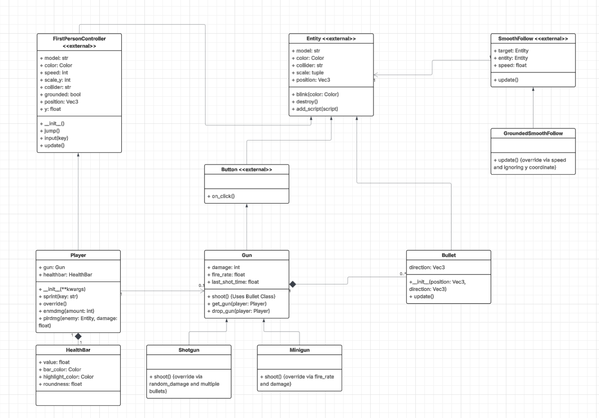
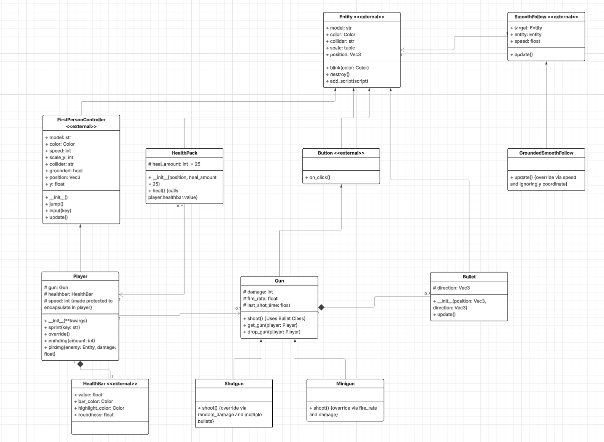

# Year 11 Accelerated Software Engineering Assessment Task 2 - First Person Shooter Simulator
### By Ronen

# Sprint 1
## Requirements Definition
***
### Functional Requirements

- Data Retrieval: The user must be able to view a gun or similar shooter on the side/middle of their screen, a crosshair in the middle.

- User Interface: The user must have a working PC or laptop with a keyboard, mouse and be aware on basic WASD and mouse clicking controls.

- Data Display: The user may be able to view kill count, ammo amount, possible a hotbar with weapons and ammo amounts corresponding to certain weapons, and other variables on the upper sides of the screen will have to be hidden.

***
### Non-Functional Requirements
- Performance: The system needs to load up in under 10 seconds, have at least 60 FPS, and all functions must function.

- Reliability: The system must not include too many major bugs/unrealistic FPS physics, and the data should be reliable in order to control this.

- Usability and Accessibility: The system must be extremely easy to get a hold of. WASD, space and mouse controls will be the only controls for playing the game, and any other controls can be accessed from the instructions tab for clear, concise player control.
***
## Determining Specifications
***
### Functional Specifications
- User Requirements: The user must be able to move around and shoot with WASD, Jump and mouse controls as well as pick up and shoot a gun.

- Inputs and Outputs: Will need to accept keyboard controls such as WASD and Jump as well as left click and moving the mouse around.

- Core Features: The program must be able to provide a fun and enjoyable FPS simulator experience, with enemies and a custom simulation gamemode where the player can spawn enemies at will.

- User Interaction: Users can interact with the system through the Ursina module, notably used for python game making, and a README can be provided to help users navigate.

- Error Handling: The system may fail to launch, crash mid-way, or miscellaneous errors may occur from runtime to developer based issues during launch.
***
### Non-Functional Specifications

- Performance: The system should be able to load in less than 30 seconds, and user input must not be delayed and FPS should be high.

- Usability/Accessibility: Possibly add a UI main menu if supported in Ursina, tutorial tab, free play (If wanting to test all weapons, gamemodes). 

- Reliability: UI design and map design will be an issue, and miscalculations along the way would possibly occur in the development process, however these will be addressed firmly due to their difficulty.
***
### Use Case

- Actor: User (Gamer/FPS Game Fan)

- Preconditions: Internet access; required specs for game, modules installed, controls understood.

- Main Flow:

1. Launch game and view tutorial: User launches the game and sees a menu screen with 4 tabs. Survival, Simulator, Tutorial, and Exit. The user would then click the tutorial to check how to play.

2. Clicks Play: User clicks survival after viewing the tutorial (As it is the normal option) and spawns in a map with a gun on the floor, and on the UI appears his health bar. After he has died he can go on to the simulation gamemode.

3. Clicks Simulation: After the user picks up the gun, they can press keys on their keyboard to spawn corresponding enemies, or an enemy to simulate an FPS experience.

4. Game End: After the game has ended, (The user has died ingame) the game shows the scores of the player. (This may not be possible due to how Ursina renders certain game objects and deletes them)

5. Loop: The user is then prompted to the menu screen again with the same 4 tabs, leading to a loop until they press the exit button, where they can view the tutorial or play before exiting. (This also may not be possible, but the player can run the application again to enable the gameplay loop in the use case scenario.)

- Postconditions: User has played the simulator/survival, understands how to play the game, and can view scores. 

***
## Design
***

### Storyboard
***

***
### Data Flow Diagram

***
### Gantt Chart
- Link for Gantt Chart: https://docs.google.com/spreadsheets/d/1Wj5dsDAvNwoj5kCc8Sz1OCvqK_soK0-2oWMVvUWk1sU/edit?gid=0#gid=0
***
## Build and Test and Launch
***
### Sprint 1 - FPS Text Based GUI Modularized with a Wave Based Gamemode

- Sprint 1 README.md
```python
# Year 11 Accelerated Software Engineering Assessment Task 2 FPS Game - Sprint 1

### Author
Ronen Gupta

## Features

- Main Menu: Choose between 4 choices, Play, Free Play, View the Tutorial, or exit the game.
- Play Mode: Standard FPS gameplay with 5 moves, but text based.
- Free Play Mode: Try from 5 weapons in text based GUI and practice shooting.
- Tutorial: View the controls for the text-based main game.
- Exit: Exit the game.

## Requirements

- To run this program, you need to install the following dependencies:
- Python 3.8 or higher
- [Ursina Engine](https://www.ursinaengine.org/) (If you want to try main.py, but Sprint 2 will contain this)

### Install dependencies
To install the required dependencies, you can run:

```bash
pip install -r requirements.txt
```
- Sprint1Module.py
```python
def show_menu():
    """Displays the main menu of the game."""
    print("==================================")
    print("Welcome to Just a normal FPS game!")
    print("==================================")
    
    
def show_options():
    """Displays the options available in the game."""
    print("- Play: Play the normal game!")
    print("- Tutorial: Understand how to play the game!")
    print("- Free Play: Play the game with every weapon and infinite waves!")
    print("- Exit: Exit the game!")
 
    

def show_Play(main):
    """Starts the main game function."""
    print("==================================")
    counter = 0 # Counter to track moves (Will be changed to a health bar/wave counter)
    gunpickup = int(input("Ready to play the game? Press 1 to pick up the gun or 2 to exit! "))
    if gunpickup == 1: # If the player picks up the gun
                    while counter != 5: # While moves are less than 5
                        # Instructions
                        print("- Move: Press 1 to move in a random direction!")
                        print("- Shoot: Press 2 to shoot an enemy!")
                        moves =  int(input("What do you want to do? ")) # Asks the user for their choice
                        if moves == 1:
                            counter += 1 # Adds 1 to the counter every move
                            print("You move north, east, south or west!")
                        elif moves == 2:
                            counter += 1 # Adds 1 to the counter every move
                            print("You shoot an enemy!")
                        else:
                             print("Invalid option!")
                    print("Game Over!")
                    main() # Calls the main function again

    if gunpickup == 2: # Exit the game
         main()

def show_Tutorial(main):
     """Displays the tutorial for the game."""
     print("==============================")
     print("===========Tutorial===========")
     print("- Move: Press 1 to move in a random direction!")
     print("- Shoot: Press 2 to shoot an enemy!")
     main() # Calls the main function after viewing

def show_freeplay(main):
     """Starts the free play mode of the game."""
     print("==================================")
     choice1 = input("Welcome to free play! Would you like to choose between weapons or exit? (Weapons or Exit are the choices) ") # Choose between weapons or exit
     if choice1.lower() == "weapons":
          weapons = {1: "Machine Gun", 2: "Submachine Gun", 3: "Shotgun", 4: "Pistol", 5: "Rocket Launcher"} # Dictionary of weapons and numbers
          print("What weapon would you like to choose? Pick a number: (1 - Machine Gun, 2 - Submachine Gun, 3 - Shotgun, 4 - Pistol, 5 - Rocket Launcher ") # Asks the user for their choice
          choice2 = int(input("Enter the number of your choice: ")) # Input the weapon number
          if choice2 in weapons: # Check if the key is in the dictionary
                    print(f"You have chosen the {weapons[choice2]}!") # Prints the weapon name from the dictionary
                    while True: # Until the user exits because its free play
                        action = input("What would you like to do? (Move, Shoot or Exit) ") # Asks the user for their choice of action
                        # Actions that can be taken
                        if action.lower() == "move":
                                print("You move north, east, south or west!")
                        elif action.lower() == "shoot":
                                print("You shoot an enemy!")
                        elif action.lower() == "exit":
                                main()
                        else:
                             print("Invalid option!")
                             show_freeplay() # Calls the show_freeplay function again
          else:
                    print("Invalid choice! Please try again.")
                    show_freeplay() # Calls the show_freeplay function again
     elif choice1.lower() == "exit": # If exit is chosen
            main() # Calls the main function again
```

- Sprint1.py
```python
from Sprint1Module import * # Imports all functions from the Sprint1Module

def main():
    """The main function that runs the text-based game."""
    show_menu() # Calls the show_menu function, displaying the menu
    show_options() # Calls the show_options function, displaying the options

    choice = str(input("Choose from Play, Tutorial, Free Play, or Exit! ")) # Asks the user for their choice
    
    if choice.lower() == "play": # Calls the show_Play function starts the game
        show_Play(main)
    elif choice.lower() == "tutorial": # Calls the show_Tutorial function, displays the tutorial
        show_Tutorial(main)
    elif choice.lower() == "free play": # Calls the show_freeplay function, starts free play
        show_freeplay(main)
    elif choice.lower() == "exit": # Calls the exit function, exits the game
        print("Thanks for playing!")
        exit()

main()
```
***
## Review
1. The program so far does not exactly follow the functional and non-functional requirements exactly, but provides a layout of what the finished program would possibly look like. This text based UI can be implemented into Ursina, as I have previously created a program suitable for the requirements of Sprint 2 with Ursina meeting most of the functional and non-functional requirements. So on and so forth, this program serves as a base for the finished product, being a text based GUI. I did not choose to do a UI based Sprint 1 due to Ursina's inbuilt Person class, which makes movement automatic and without the requirement of UI based buttons. I tried this and I found it useless, so I resorted to a text based GUI which allowed for a more dynamic approach to what would be the finished product. Sprint 2 may include some features from Sprint 1, but will not have all of them but will be in much better quality overall via Ursina Engine rendering.

2. The use case I created was perfectly replicated by the text based GUI I made, being incredibly similar in progression and only contains few minor changes (I made the main game end in 5 moves instead of waiting for the player to die as I would require Ursina). It takes input and produces output to a high standard, allowing for good behavourial replication.

3. Organisation and readability was distinctive in the text based GUI I made. With the use of modularization, docstrings, comments and function organisation/naming, it was simply impossible for not being able to understand the program. Overall, an outstanding use of quality in the GUI.

4. The next stage of development should immediately implement OOP and further complex aspects of classes. I had already created a base for Sprint 2 which I originally planned to be Sprint 1, however due to Sprint 1 requirements of text based GUI, I resorted to the main.py that is currently in the repository to be submitted as Sprint 2 after being modularised and tweaked a little more. This would add the inbuilt function for FPS controller, and I would also add a working gun (Pistol for now) and an interesting feature, a hookshot, allowing for the user to traverse quicker as if using a grapple gun, possibly a good idea for map design in the game. Overall, huge changes would occur when transitioning from text based to Ursina, and I would be ready to further enhance further from Sprint 2 onwards, adding a simulation, UI and other functional/non-functional requirements that the game requires.

5. Additional Note: I would change my idea from a wave based gamemode to a simulation gamemode, as a simulation would allow for a more dynamic user experience in sprint 2. This sprint was only for a planning and a base, but I will have created sprint 2 with a much more dynamic experience, via spawning enemies.
***
# Sprint 2
***
## Design
***
### Structure Chart
***
- Structure Chart Link: https://lucid.app/lucidchart/a7502c93-40f1-4177-8ae0-81a087ce42e5/edit?viewport_loc=-3977%2C-747%2C7521%2C4361%2C0_0&invitationId=inv_97050906-2981-4845-a7dc-ff05265b3f41
***

### Algorithms
***
- Pseudocode for Main Routine
```python
BEGIN MAIN ROUTINE
        INPUT OPTION/User_Input
            DISPLAY MAIN MENU WITH OPTIONS: (menu)
            - Simulator Game
            - Survival Game
            - Tutorial
            - Exit Game

            CHOOSE OPTION/User_Input

            IF OPTION = Simulator Game THEN
                ENTER Simulator MODE (start_game)
                    WHILE HEALTH > 0 DO
                        MOVE CHARACTER WITH WASD (FirstPersonController Class)
                        PICK UP/ SWAP GUN WITH LEFT MOUSE BUTTON (get_gun)
                        SPAWN ENEMY BY PRESSING E (spawn_enemy)
                        SHOOT GUN WITH LEFT MOUSE BUTTON AND INFLICT DAMAGE TO ENEMIES (shoot)(plrdmg)
                        SPRINT WITH SHIFT KEY (sprint)
                        CHECK FOR ENEMY DAMAGE (enmdmg)
                        PREVENT PLAYER FROM NOCLIPPING IN GROUND OR JUMPING INFINITELY (override)
                    END WHILE
                    EXIT GAME
            ENDIF
            
            ELSE IF OPTION = Survival Game THEN
                ENTER Survival MODE (survival_game)
                    WHILE HEALTH > 0 DO
                        MOVE CHARACTER WITH WASD (FirstPersonController Class)
                        PICK UP/ SWAP GUN WITH LEFT MOUSE BUTTON (get_gun)
                        FACE AUTOMATIC ENEMY WAVES (random_spawn_enemy) (spawn_enemies_randomly)
                        SHOOT GUN WITH LEFT MOUSE BUTTON AND INFLICT DAMAGE TO ENEMIES (shoot)(plrdmg)
                        SPRINT WITH SHIFT KEY (sprint)
                        VIEW ELAPSED TIME AND ENEMIES KILLED/ALIVE (update_time_elapsed_texts)
                        CHECK FOR ENEMY DAMAGE (enmdmg)
                        PREVENT PLAYER FROM NOCLIPPING IN GROUND OR JUMPING INFINITELY (override)
                    END WHILE
                    EXIT GAME
            ENDIF

            ELSE IF OPTION = Tutorial THEN
                WHILE NOT EXITED OUT OF TUTORIAL
                    VIEW TUTORIAL (instructions)
                    READ HOW TO PLAY AND CONTROLS
                ENDWHILE
                RETURN TO MAIN MENU (exit_button)
            ENDIF

            ELSE IF OPTION = Exit Game THEN
                EXIT GAME (application.quit())
            ENDIF
END MAIN ROUTINE
```

***
- Pseudocode for 1st Subroutine: get_gun(player, gun)
```python
BEGIN SUBROUTINE get_gun(player, gun)
    TRY FOLLOWING CODE:
        SET THE GUN PARENT TO THE CAMERA
        SET THE GUN POSITION TO (0, -0.75, 0.5)
        ASSIGN THE GUN TO THE PLAYER GUN ATTRIBUTE
        DISABLE THE GUN COLLIDER (Set to None)
    EXCEPT ANY EXCEPTIONS/ERRORS IN CODE AS e:
        PRINT "Error getting gun: " + e
    ENDTRY
END SUBROUTINE get_gun(player, gun)
```
***
- Pseudocode for 2nd Subroutine: Sprint(player, key)
```python
BEGIN SUBROUTINE Sprint(player, key)
    TRY FOLLOWING CODE:
        IF KEY PRESSED = "shift" THEN
            SET PLAYER SPEED ATTRIBUTE TO 20
        ELSE IF KEY PRESSED = "shift up" THEN
            SET PLAYER SPEED ATTRIBUTE TO 10
        END IF
    EXCEPT ANY EXCEPTIONS/ERRORS IN CODE AS e:
        PRINT "Error in sprint function:" + e
    ENDTRY
END SUBROUTINE Sprint(player, key)
```
***

- Flowchart Link for Main Routine: https://lucid.app/lucidchart/7378e435-dfa0-4ff1-99c0-97a8c9b4f082/edit?viewport_loc=-1284%2C-3175%2C4265%2C2473%2C0_0&invitationId=inv_41a6d45c-c485-4775-b72f-11b6179271bc

***

- Flowchart Link for 1st Subroutine: https://lucid.app/lucidchart/492bef2d-3dce-4634-8be1-252f38edce14/edit?viewport_loc=-268%2C17%2C1616%2C1891%2C0_0&invitationId=inv_1a4c9659-a7fd-418b-9811-d407df376529

***

- Flowchart Link for 2nd Subroutine: https://lucid.app/lucidchart/136f14b2-eca1-4aad-a27a-23c5967c5a85/edit?viewport_loc=-424%2C-5%2C2009%2C2351%2C0_0&invitationId=inv_d9180f6a-e5e6-4fba-a546-3672393d58e7

## Build and Test and Launch
***

### Sprint 2 Ursina FPS Game with GUI Modularized with a survival gamemode

- Sprint 2 README.md
```python
# Year 11 Accelerated Software Engineering Assessment Task 2 FPS Game - Sprint 2

### Author
Ronen Gupta

## Features

- Main Menu: Choose between 4 choices, Survival, Free Play, View the Tutorial, or exit the game.
- Survival Mode: Standard survival FPS gameplay, with hookshots and enemies, survive for as long as you can!
- Free Play Mode: Try spawning enemies of your own and try guns! (Will add more guns and enemies)
- Tutorial: View the controls for the gamemodes.
- Exit: Exit the game.

## Requirements

- To run this program, you need to install the following dependencies:
- Python 3.8 or higher
- [Ursina Engine](https://www.ursinaengine.org/)

### Install dependencies
To install the required dependencies, you can run:

```bash
pip install -r requirements.txt
```

- Sprint2Module.py
```python
from ursina import * # Ursina library
import random # Random library

def random_spawn_enemy(player):
    """Spawns enemies at random positions within a specified range (-50 to 50 on x and z axes)."""
    try:
        x = random.uniform(-50, 50) # Random x-coordinate
        z = random.uniform(-50, 50) # Random z-coordinate
        enemy = Entity(model='cube', color=color.blue, collider = 'box', scale = (1, 2, 1), position=(x, 1, z), health=100) # Creates an enemy at a random position
        enemy.collider.visible = True # Makes the collider visible
        enemy.add_script(GroundedSmoothFollow(target=player, offset=[0, 0, 0], speed=10)) # Adds a script to follow the player
        return enemy # Returns the created enemy entity
    except Exception as e:
        print(f"Error spawning random enemy: {e}")


# Sprinting function (Works)
def sprint(player, key):
    """Function to handle sprinting mechanics for the player."""
    try:
        if key == "shift": # Checks if the shift key is pressed
            player.speed = 20 # Sets player speed to 20 when sprinting
        elif key == "shift up": # Checks if the shift key is released
            player.speed = 10 # Resets player speed to 10 when not sprinting
    except Exception as e:
        print(f"Error in sprint function: {e}")

# Spawn Enemy function
def spawn_enemy(player):
    """Function to spawn an enemy at a given position with specified properties."""
    try:
        enemy = Entity(model='cube', color=color.blue, collider = 'box', scale = (1, 2, 1), position=(5, 1, 5), health=100) # Creates an enemy entity
        enemy.collider.visible = True # Makes the collider visible
        enemy.add_script(GroundedSmoothFollow(target=player, offset=[0, 0, 0], speed=10)) # Adds a script to follow the player
        return enemy # Returns the created enemy entity
    except Exception as e:
        print(f"Error spawning enemy: {e}")

# Get gun function (Works)
def get_gun(player, gun):
    """Function to equip a gun to the player."""
    try:
        gun.parent = camera # Sets the parent of the gun to the camera
        gun.position = Vec3(0,-.75,.5) # Sets the position of the gun relative to the camera
        player.gun = gun # Assigns the gun to the player
        gun.collider = None # Removes the collider from the gun to prevent collisions
    except Exception as e:
        print(f"Error getting gun: {e}")

# Made an inherited class from Entity to create a bullet that moves in the direction it was shot
class Bullet(Entity):
    """A class inherited from Entity, being a bullet with properties such as position, direction, and collision."""
    def __init__(self, position, direction): # Position and direction are passed as parameters
        try:
            super().__init__(parent=scene, model='cube', scale=1, color=color.black, collider='box', position = position) # Initializes the bullet entity with a cube model, black color, and box collider
            self.direction = direction.normalized() # Sets the direction of the bullet
            self.look_at(position + self.direction) # Makes the bullet look at the position it is moving towards
        except Exception as e:
            print(f"Error initializing Bullet: {e}")

    def update(self):
        """Updates the bullets position and checks for collisions."""
        try:
            # Moves the bullet in the direction it is facing, checks for collisions, destroys if it hits something or if it goes 1000 units away from the camera
            self.position += self.direction * 1000 * time.dt # Moves the bullet in the direction it is facing
            hit_info = self.intersects() # Checks for collisions with other entities
            if hit_info.hit: # If the bullet hits something
                destroy(self) # Destroy the bullet if it hits something
                return # Exit the update method, prevent further movement
            if distance(self.position, camera.world_position) > 1000: # Checks if the bullet is further than 1000 units away from the camera
                destroy(self) # Destroys the bullet if it is too far away from the camera
        except Exception as e:
            print(f"Error updating Bullet: {e}")

# Controls gun shooting, such as sound, gun color, bullets, and bullet shooting
def shoot(gun, key):
    """Function to spawn bullets when the left mouse button is pressed."""
    try:
        if key == 'left mouse down': # If the left mouse button is pressed
            Audio("assets/laser_sound.wav") # Play the laser sound
            gun.blink(color.red) # Makes the gun blink red to indicate shooting
            offset = Vec3(0, 0, 0) # Offset for the bullet position is straight in front of the gun
            Bullet(position=gun.world_position + gun.forward * 1.5 + offset, direction=gun.forward) # Creates a bullet entity at the position of the gun
    except Exception as e:
        print(f"Error in shoot function: {e}")


# Controls enemy damaging player and death
def enmdmg(player, healthbar, enemy): 
    """Function to handle enemy damage and death"""
    try:
        if player.intersects(enemy).hit: # Checks if the player collides with the enemy
            healthbar.value -= 1 # Decreases the health bar value by 1
        if healthbar.value <= 0: # Checks if the health bar value is less than or equal to 0
            quit() # Quit the game if the healthbar is empty (Will change to game over screen later)
    except Exception as e:
        print(f"Error in enmdmg function: {e}")


def plrdmg(player, enemy):
    """Function to handle player damage to the enemy. Uses raycasting to detect if it hit anything and if it is the enemy."""
    try:
        hit_info = raycast(camera.world_position, camera.forward, distance=500, ignore=[player], debug=False) # Raycasts from the camera's position in the direction it is facing
        if hit_info.hit and hit_info.entity == enemy: # Checks if the raycast hit an entity
            enemy.blink(color.red) # Blinks the enemy red to indicate it has been hit
            invoke(setattr, enemy, 'color', color.blue, delay=0.15) # Delay the color change to blue after being hit
            enemy.health -= 5 # Decreases the enemy's health by 5
            print(f"Enemy hit! Health: {enemy.health}") # Prints the enemy health to the console
            if enemy.health <= 0: # Checks if the enemy's health is less than or equal to 0
                print("Enemy defeated!") # Prints a message to the console when the enemy is defeated
                destroy(enemy) # Destroys the enemy entity when defeated
                return True # Returns True if enemy is defeated, for potential actions
    except Exception as e:
        print(f"Error in plrdmg function: {e}")

# Only allow jumping when grounded, fixes bugs in jumping to the player
def override(player):
    """Function to override the player's jumping behavior to ensure it only occurs when grounded."""
    try:
        # Checks if the player is not grounded and is above ground level, then it moves the player down
        # and rounds the players position to 3 decimal places to prevent no-clipping.
        if not player.grounded and player.y > 0:
            player.y -= 0.1
            player.position = Vec3(round(player.x, 3), round(player.y, 3), round(player.z, 3))
    except Exception as e:
        print(f"Error in override function: {e}")

def menu(start_game, survival_game, instructions):
    """Function to handle the main menu of the game."""
    try:
        menu_bg = Entity(parent = camera.ui, model = 'quad', scale = (0.7,0.5), color = color.dark_gray, z = 1) # Menu BG

        title = Text(text="Generic FPS Game.py", scale = 2, y = 0.25, parent = camera.ui, color = color.azure, background=True, origin=(0,0)) # Title

        start_button = Button(text="Simulator Game", scale=(0.3, 0.12), y=0, x=-0.18, color= color.azure, parent=camera.ui) # Start Button for Simulator Game
        survivalplay_button = Button(text="Survival Game", scale=(0.3, 0.12), y=0, x=-0.50, color = color.azure, parent=camera.ui) # Start Button for Survival Game
        tutorial_button = Button(text="Tutorial", scale=(0.3, 0.12), y=0, x=0.50, color= color.azure, parent=camera.ui) # Tutorial Button
        exit_button = Button(text="Exit Game", scale=(0.3, 0.12), y=0, x=0.18, color = color.red, parent=camera.ui) # Exit Button

        start_button.on_click = lambda: (destroy(menu_bg), destroy(title), destroy(start_button), destroy(exit_button), destroy(survivalplay_button), destroy(tutorial_button), start_game(), print("Game Started!")) # Calls the start_game function in Sprint2.py when the start button is clicked
        survivalplay_button.on_click = lambda: (destroy(menu_bg), destroy(title), destroy(start_button), destroy(exit_button), destroy(survivalplay_button), destroy(tutorial_button), survival_game(), print("Freeplay Mode Activated!")) # Calls the survival_game function in Sprint2.py when the survival button is clicked
        tutorial_button.on_click = lambda: (destroy(menu_bg), destroy(title), destroy(start_button), destroy(exit_button), destroy(survivalplay_button), destroy(tutorial_button), instructions(), print("Tutorial Mode Activated!")) # Calls the instructions function in Sprint2.py when the tutorial button is clicked
        exit_button.on_click = application.quit # Exits the game when the exit button is clicked
    except Exception as e:
        print(f"Error in menu function: {e}")
        
    
# Make sure the enemy is always grounded and never no-clipping
class GroundedSmoothFollow(SmoothFollow):
    # Make a subclass using inhertance from the SmoothFollow class in Ursina
    """A subclass/childclass of SmoothFollow from Ursina that ensures the entity not only follows the target but also stays grounded."""
    # We use a form of polymorphism here to override the update method of SmoothFollow
    def update(self):
        try:
            direction = Vec3(self.target.x - self.entity.x, 0, self.target.z - self.entity.z).normalized() # Calculates the direction vector from the target to the entity, ignoring the y axis to keep the entity grounded
            self.entity.position += direction * self.speed * time.dt # Moves the entity towards the target at a specified speed, ensuring it stays grounded by not changing the y position
        except Exception as e:
            print(f"Error in GroundedSmoothFollow update method: {e}")
```
***
- Sprint2.py
```python
from ursina import * # Ursina Library
from ursina.prefabs.first_person_controller import FirstPersonController # First Person Controller from Ursina
from ursina.prefabs.health_bar import HealthBar # Health Bar from Ursina
from Sprint2Module import get_gun, sprint, shoot, enmdmg, override, plrdmg, menu, spawn_enemy, random_spawn_enemy # Importing function from my Sprint2Module
import random # Import random for spawning enemies randomly

enemies_alive = [] # List to keep track of alive enemies
enemies_killed = 0 # Variable to keep track of killed enemies
time_elapsed = 0 # Variable to keep track of time elapsed in survival mode

def start_game():
    """Initialises the simulator gamemode, where the player can spawn enemies and shoot them, as well as use a hookshot."""

    global ground, input

    # Sync the game to the monitor's refresh rate, default 60hz to prevent screen tearing
    window.vsync = True

    # Initialises the program to be defaulted to fullscreen and window.borderless helps with mouse movement issues on macOS
    window.borderless = False 

    # Initialises the FirstPersonController class from the inbuilt ursina.prefabs.first_person_controller module as player, 
    # and the Entity class from the ursina module as ground, as well as the sky class and healthbar from the ursina.prefabs.health_bar module as HealthBar.
    player = FirstPersonController(model='cube', color=color.clear, speed = 10, scale_y=2, collider='box')
    healthbar = HealthBar(bar_color = color.lime.tint(-.25), roundness=.5, highlight_color = color.yellow.tint(-.2))
    ground = Entity(model='plane', collider='box',scale = 128, texture ='grass')
    Sky()

    # Initialises the player having no gun and makes a gun from the Button class and puts it on the ground, and calls the get_gun function
    player.gun = None
    gun = Button(parent=scene, model='assets/gun.obj', color=color.gold, origin_y=-.5, position=(3,0,3), scale=(.4,.4,.2))
    gun.on_click = lambda: get_gun(player, gun)

    # Makes a hookshot from the inbuilt ursina.prefabs.first_person_controller module as well as the functions
    hookshot_target = Button(parent=scene, model='cube', color=color.brown, position=(4,5,5))
    hookshot_target.on_click = Func(player.animate_position, hookshot_target.position, duration=.5, curve=curve.out_quad)

    # Text that shows the user the number of enemies currently alive and killed
    enemies_text = Text(text = f'Enemies Killed: {enemies_killed} | Enemies Alive: {len(enemies_alive)}', position = (0, 0.45), scale = 1, color = color.white)

    def update_enemy_texts():
        """Updates the enemies text to show the number of enemies killed and alive."""
        enemies_text.text = f'Enemies Killed: {enemies_killed} | Enemies Alive: {len(enemies_alive)}'

    # Handles other functions such as sprinting, shooting, enemy damaging, and an override function to prevent buggy player
    def input(key):
        global enemies_killed, enemies_alive
        """Function that handles the main input for the game, such as sprinting, shooting, and player/enemy damage."""
        sprint(player, key) # Sprint function
        override(player) # Prevents jumping when not grounded
        if player.gun == gun: # Checks if the player has a gun
            shoot(gun, key) # Allows the player to shoot the gun
        if key == 'left mouse down': # Checks if the left mouse button is pressed
            for enemy in enemies_alive[:]: # Loops through all alive enemies
                if plrdmg(player, enemy): # Checks if the player kills the enemy
                    enemies_alive.remove(enemy) # Removes the enemy from the alive list
                    enemies_killed += 1 # Adds to the enemies killed count
                    update_enemy_texts() # Updates the enemies text
        if key == 'e': # Checks if the E key is pressed
            enemy = spawn_enemy(player) # Spawns an enemy
            enemies_alive.append(enemy) # Adds the enemy to the alive list
            update_enemy_texts() # Updates the enemies text
        for enemy in enemies_alive: # Loops through all alive enemies
            enmdmg(player, healthbar, enemy) # Handles enemy damaging the player

def survival_game():
    """Initialises the survival gamemode, where the player must survive for as long as possible against endless waves of enemies."""
    global ground, input, time_elapsed, update, gun

    # Sync the game to the monitor's refresh rate, default 60hz to prevent screen tearing
    window.vsync = True

    # Initialises the program to be defaulted to fullscreen and window.borderless helps with mouse movement issues on macOS
    window.borderless = False 

    # Time elapsed variable
    time_elapsed = 0

    # Initialises the FirstPersonController class from the inbuilt ursina.prefabs.first_person_controller module as player, 
    # and the Entity class from the ursina module as ground, as well as the sky class and healthbar from the ursina.prefabs.health_bar module as HealthBar.
    player = FirstPersonController(model='cube', color=color.clear, speed = 10, scale_y=2, collider='box')
    healthbar = HealthBar(bar_color = color.lime.tint(-.25), roundness=.5, highlight_color = color.yellow.tint(-.2))
    ground = Entity(model='plane', collider='box',scale = 128, texture ='grass')
    Sky()

    # Initialises the player having a gun and makes a gun from the Button class and calls the get_gun function instantly
    gun = Button(parent=scene, model='assets/gun.obj', color=color.gold, origin_y=-.5, position=(3,0,3), scale=(.4,.4,.2))
    player.gun = gun
    get_gun(player, gun)

    # Makes a hookshot from the inbuilt ursina.prefabs.first_person_controller module as well as the functions
    hookshot_target = Button(parent=scene, model='cube', color=color.brown, position=(4,5,5))
    hookshot_target.on_click = Func(player.animate_position, hookshot_target.position, duration=.5, curve=curve.out_quad)

    # Enemies text which tracks the enemies killed and alive
    enemies_text = Text(text = f'Enemies Killed: {enemies_killed} | Enemies Alive: {len(enemies_alive)}', position = (0, 0.45), scale = 1, color = color.white)

    # Function that updates the enemies text
    def update_enemy_texts():
        """Updates the enemies text to show the number of enemies killed and alive."""
        enemies_text.text = f'Enemies Killed: {enemies_killed} | Enemies Alive: {len(enemies_alive)}'

    # Time text that tracks the elapsed time when the survival gamemode is selected
    time_text = Text(text = f'Elapsed Time: {int(time_elapsed)}', position = (0.5, 0.45), scale=1, color= color.white)

    # Updates the time elapsed per frame and the text
    def update_time_elapsed_texts():
        """Updates the elapsed time to show the time elapsed"""
        global time_elapsed
        time_elapsed += time.dt
        time_text.text = f'Elapsed time: {int(time_elapsed)}'

    # Spawns enemies randomly and adds them to a list, and tracks the alive enemies
    def spawn_enemies_randomly():
        """Spawns enemies randomly and adds them to the enemies_alive list."""
        enemy = random_spawn_enemy(player)
        enemies_alive.append(enemy)
        update_enemy_texts()
        invoke(spawn_enemies_randomly, delay=random.uniform(5, 12))

    # Calls the function
    spawn_enemies_randomly()

    # Updates the time every frame, using the unique update function in Ursina
    def update():
        update_time_elapsed_texts()

    # Controls the main functions of the game
    def input(key):
        global enemies_killed, enemies_alive
        """Function that handles the main input for the game, such as sprinting, shooting, and player/enemy damage."""
        sprint(player, key) # Sprint function
        override(player) # Prevents jumping when not grounded
        if player.gun == gun: # Checks if the player has a gun
            shoot(gun, key) # Allows the player to shoot the gun
        if key == 'left mouse down': # Checks if the left mouse button is pressed
            for enemy in enemies_alive[:]: # Loops through all alive enemies
                if plrdmg(player, enemy): # Checks if the player kills the enemy
                    enemies_alive.remove(enemy) # Removes the enemy from the alive list
                    enemies_killed += 1 # Adds to the enemies killed count
                    update_enemy_texts() # Updates the enemies text
        for enemy in enemies_alive: # Loops through all alive enemies
            enmdmg(player, healthbar, enemy) # Handles enemy damaging the player

def instructions():
     """Initialises the instructions menu for the game, showing the user how to play the game and the controls."""
     tutorial_bg = Entity(parent=camera.ui, model='quad', scale=(0.7, 0.5), color=color.dark_gray, z=1)
     maingamemodes = Text("How to play:\n" "Survival Gamemode: Survive waves of enemies and live for as long as you can!\n" "Freeplay Gamemode: Spawn enemies with the E key, use different guns, and simulate FPS!\n" "Exit: Exits the game (See ya!)", parent=tutorial_bg, position=(-0.85, 0.25), scale=1.75, color=color.white)
     maincontrols = Text("Main Controls:\n" "WASD: Move the player around!\n" "Left mouse button: Shoot the gun!\n" "Shift: Sprint like the wind!\n" "E Key (Only in Freeplay): Spawns Enemies!", parent=tutorial_bg, position=(-0.85, -0.25), scale=1.75, color=color.white)
     exit_button = Button(text="Exit", parent=tutorial_bg, position=(-1.1, 0.91), scale=(0.1, 0.05), color=color.red, on_click= lambda: (destroy(maincontrols), destroy(maingamemodes), destroy(tutorial_bg), destroy(exit_button), menu(start_game, survival_game, instructions)))


# Calls the menu function, fullscreen, and runs the game
app = Ursina(fullscreen=True)
menu(start_game, survival_game, instructions)
app.run()
```
***
## Review
1. Judging by my newly made functional and non-functional requirements, Sprint 2 successfully meets the majority outlined in my documentation. The game provides a visible gun, crosshair, healthbar, and allows the player to move, shoot and spawn enemies as specified. A UI menu has also been incorporated for the gamemodes, and the tutorial, which are highly accessible, meeting user interaction requirements. Non-functional requirements such as performance and reliability are also addressed, as the game loads quickly, runs smoothly, and includes error handling in all major functions to prevent crashing. There are clear controls and instructions provided, and the UI updates in real time to reflect game state changes. Furthermore, the project is exponentially successful in aligning with functional and non-functional requirements from the last sprint, meeting the planned criteria and expectations.

2. The program performs well against the modified use-cases identified. When the game is launched, users are greeted with a menu and can easily navigate to different gamemodes or the tutorial. Many functionalities in the use case process such as picking up the gun, shooting, and spawning enemies all work as intended. UI elements such as the healthbar and enemy counters also update correctly, however the game can be enhanced if the user is directed to the menu after ingame death rather than breaking from the ingame loop. The program behaves as expected for most of the use-case, however it would be enhanced if the score was outputted to the user and they were prompted back to the main menu after death.

3. The code demonstrates good readability and maintainability. Functions and classes are modularized from the main gameflow, and docstrings and comments explain their purpose. Error handling is robustly applied for each function, allowing for debugging to be made easier. The structure in both the main.py and module.py also enhanced structure and makes future modifications straightforward. Overall, the code is clean, well documented, and easy to maintain.

4. Several improvements can be made in Sprint 3. As I have already implemented OOP fundamentals, the next sprint will be mostly about adding more features and organising code. Feature-wise, adding more weapons, enemies, and a gameover screen (May or may not be possible) would allow for gameplay variety and user engagement. These enhancements will allow for a polished, feature-complete product, and will pave the way for models and possibly shaders to be implemented.

***

# Sprint 3
***
## Design
***
### UML Class Diagram
***

- Link for UML Class Diagram: https://lucid.app/lucidchart/7a43b1b1-4a0f-4c7d-b471-31365a016df0/edit?viewport_loc=-2663%2C-275%2C3489%2C2537%2C0_0&invitationId=inv_af2ebc14-2abf-4cab-ab10-330983666845
***
## Build and Test and Launch
***
### Sprint 3 Ursina FPS Game with more features, already containing classes and also added functions as class methods
***

- Sprint3README
```python
# Year 11 Accelerated Software Engineering Assessment Task 2 FPS Game - Sprint 3

### Author
Ronen Gupta

## Features

- Main Menu: Choose between 4 choices, Survival, Free Play, View the Tutorial, or exit the game.
- Survival Mode: Standard survival FPS gameplay, with hookshots and enemies, survive for as long as you can!
- Free Play Mode: Try spawning enemies of your own and try guns! (Added the minigun and the shotgun)
- Tutorial: View the controls for the gamemodes.
- Exit: Exit the game.

## Requirements

- To run this program, you need to install the following dependencies:
- Python 3.8 or higher
- [Ursina Engine](https://www.ursinaengine.org/)

### Install dependencies
To install the required dependencies, you can run:

```bash
pip install -r requirements.txt
```
- Sprint3Module.py
```python
from ursina import * # Ursina library
import random # Random library
from ursina.prefabs.first_person_controller import FirstPersonController # First Person Controller from Ursina
from ursina.prefabs.health_bar import HealthBar # Health Bar from Ursina

def random_spawn_enemy(player):
    """Spawns enemies at random positions within a specified range (-50 to 50 on x and z axes)."""
    try:
        x = random.uniform(-50, 50) # Random x-coordinate
        z = random.uniform(-50, 50) # Random z-coordinate
        enemy = Entity(model='cube', color=color.blue, collider = 'box', scale = (1, 2, 1), position=(x, 1, z), health=100) # Creates an enemy at a random position
        enemy.add_script(GroundedSmoothFollow(target=player, offset=[0, 0, 0], speed=10)) # Adds a script to follow the player using GroundedSmoothFollow
        return enemy # Returns the created enemy entity
    except Exception as e: # Error handling
        print(f"Error spawning random enemy: {e}")

# Spawn Enemy function
def spawn_enemy(player):
    """Function to spawn an enemy at a given position with specified properties."""
    try:
        enemy = Entity(model='cube', color=color.blue, collider = 'box', scale = (1, 2, 1), position=(5, 1, 5), health=100) # Creates an enemy entity
        enemy.add_script(GroundedSmoothFollow(target=player, offset=[0, 0, 0], speed=10)) # Adds a script to follow the player using GroundedSmoothFollow
        return enemy # Returns the created enemy entity
    except Exception as e: # Error handling
        print(f"Error spawning enemy: {e}")

# Menu function
def menu(start_game, survival_game, instructions):
    """Function to handle the main menu of the game."""
    try:
        menu_bg = Entity(parent = camera.ui, model = 'quad', scale = (0.7,0.5), color = color.dark_gray, z = 1) # Menu BG

        title = Text(text="Doom.py", scale = 2, y = 0.25, parent = camera.ui, color = color.azure, background=True, origin=(0,0)) # Title for the game

        start_button = Button(text="Simulator Game", scale=(0.3, 0.12), y=0, x=-0.18, color= color.azure, parent=camera.ui) # Start Button for Simulator Game
        survivalplay_button = Button(text="Survival Game", scale=(0.3, 0.12), y=0, x=-0.50, color = color.azure, parent=camera.ui) # Start Button for Survival Game
        tutorial_button = Button(text="Tutorial", scale=(0.3, 0.12), y=0, x=0.50, color= color.azure, parent=camera.ui) # Tutorial Button
        exit_button = Button(text="Exit Game", scale=(0.3, 0.12), y=0, x=0.18, color = color.red, parent=camera.ui) # Exit Button

        start_button.on_click = lambda: (destroy(menu_bg), destroy(title), destroy(start_button), destroy(exit_button), destroy(survivalplay_button), destroy(tutorial_button), start_game(), print("Game Started!")) # Calls the start_game function in Sprint2.py when the start button is clicked
        survivalplay_button.on_click = lambda: (destroy(menu_bg), destroy(title), destroy(start_button), destroy(exit_button), destroy(survivalplay_button), destroy(tutorial_button), survival_game(), print("Freeplay Mode Activated!")) # Calls the survival_game function in Sprint2.py when the survival button is clicked
        tutorial_button.on_click = lambda: (destroy(menu_bg), destroy(title), destroy(start_button), destroy(exit_button), destroy(survivalplay_button), destroy(tutorial_button), instructions(), print("Tutorial Mode Activated!")) # Calls the instructions function in Sprint2.py when the tutorial button is clicked
        exit_button.on_click = application.quit # Exits the game when the exit button is clicked
    except Exception as e: # Error handling
        print(f"Error in menu function: {e}")

# Made an inherited class from Entity to create a bullet that moves in the direction it was shot
class Bullet(Entity):
    """A class inherited from Entity, being a bullet with properties such as position, direction, and collision."""
    def __init__(self, position, direction): # Position and direction are passed as parameters
        try:
            super().__init__(parent=scene, model='cube', scale=1, color=color.black, collider='box', position = position) # Initializes the bullet entity with a cube model, black color, and box collider
            self.direction = direction.normalized() # Sets the direction of the bullet
            self.look_at(position + self.direction) # Makes the bullet look at the position it is moving towards
        except Exception as e: # Error handling
            print(f"Error initializing Bullet: {e}")

    # Class method that updates the bullets position after predetermined attributes
    def update(self):
        """Updates the bullets position and checks for collisions."""
        try:
            self.position += self.direction * 1000 * time.dt # Moves the bullet in the direction it is facing
            hit_info = self.intersects() # Checks for collisions with other entities
            if hit_info.hit: # If the bullet hits something
                destroy(self) # Destroy the bullet if it hits something
                return # Exit the update method, prevent further movement
            if distance(self.position, camera.world_position) > 1000: # Checks if the bullet is further than 1000 units away from the camera
                destroy(self) # Destroys the bullet if it is too far away from the camera
        except Exception as e: # Error handling
            print(f"Error updating Bullet: {e}")

# Player class inherited from FirstPersonController
class Player(FirstPersonController):
    def __init__(self, **kwargs):
        super().__init__(model='cube', color=color.clear, speed=10, scale_y=2, collider='box', **kwargs) # Uses super to set attributes to certain values and store in dict using **kwargs
        self.gun = None # Initialises the player to not have a gun
        self.healthbar = HealthBar(bar_color=color.lime.tint(-.25), roundness=.5, highlight_color=color.yellow.tint(-.2)) # Initialises a healthbar for the player

    # Sprint method for the class
    def sprint(self, key):
        """Function to handle sprinting mechanics for the player."""
        try:
            if key == "shift": # Checks if the shift key is pressed
                self.speed = 20 # Sets player speed to 20 when sprinting
            elif key == "shift up": # Checks if the shift key is released
                self.speed = 10 # Resets player speed to 10 when not sprinting
        except Exception as e: # Error handling
            print(f"Error in sprint function: {e}")

    # Fixes the player's jumps so it doesn't glitch out
    def override(self):
        """Function to override the player's jumping behavior to ensure it only occurs when grounded."""
        try:
            if not self.grounded and self.y > 0: # If the player is not grounded and is above ground level
                self.y -= 0.1 # Move the player down -.1
                self.position = Vec3(round(self.x, 3), round(self.y, 3), round(self.z, 3)) # Round coords of the player to ensure no no-clipping
        except Exception as e: # Error handling
            print(f"Error in override function: {e}")

    # Handles player damage from enemies
    def enmdmg(self, amount):
        """Function to handle player damage from enemies."""
        try:
            self.healthbar.value -= amount # Subtracts the healthbar amount
            if self.healthbar.value <= 0: # If the healthbar amount is less than or equal to 0
                quit() # Quit the game as the player has died
        except Exception as e: # Error handling
            print(f"Error in enmdmg function: {e}")

    # Handles player damage to the enemy
    def plrdmg(self, enemy, damage):
        """Function to handle player damage to the enemy. Uses raycasting to detect if it hit anything and if it is the enemy."""
        try:
            hit_info = raycast(camera.world_position, camera.forward, distance=500, ignore=[self], debug=False) # Raycasts from the camera's position in the direction it is facing
            if hit_info.hit and hit_info.entity == enemy: # Checks if the raycast hit an entity
                enemy.blink(color.red) # Blinks the enemy red to indicate it has been hit
                invoke(setattr, enemy, 'color', color.blue, delay=0.15) # Delay the color change to blue after being hit
                enemy.health -= damage # Decreases the enemy's health by gun damage
                print(f"Enemy hit! Health: {enemy.health}") # Prints the enemy health to the console
                if enemy.health <= 0: # Checks if the enemy's health is less than or equal to 0
                    print("Enemy defeated!") # Prints a message to the console when the enemy is defeated
                    destroy(enemy) # Destroys the enemy entity when defeated
                    return True # Returns True if enemy is defeated, for potential actions
        except Exception as e: # Error handling
            print(f"Error in plrdmg function: {e}")
      
# Make sure the enemy is always grounded and never no-clipping
class GroundedSmoothFollow(SmoothFollow):
    # Make a subclass using inhertance from the SmoothFollow class in Ursina
    """A subclass/childclass of SmoothFollow from Ursina that ensures the entity not only follows the target but also stays grounded."""
    # We use a form of polymorphism here to override the update method of SmoothFollow
    def update(self):
        try:
            direction = Vec3(self.target.x - self.entity.x, 0, self.target.z - self.entity.z).normalized() # Calculates the direction vector from the target to the entity, ignoring the y axis to keep the entity grounded
            self.entity.position += direction * self.speed * time.dt # Moves the entity towards the target at a specified speed, ensuring it stays grounded by not changing the y position
        except Exception as e: # Error handling
            print(f"Error in GroundedSmoothFollow update method: {e}")

# Gun class that the player can equip and shoot inherited from button
class Gun(Button):
    """A subclass/childclass of Button that allows the user to press it like a button ingame and pick it up, also allowing for shooting"""
    def __init__(self, model, color, position, scale, damage=50, fire_rate=0.5, **kwargs): # Sets some attributes in a dict using **kwargs and defines some beforehand
        super().__init__(parent=scene, model=model, color=color, origin_y=-.5, position=position, scale=scale, **kwargs) # Values added to keys defined in attributes beforehand using super avoiding redundancy
        # New attributes for the gun
        self.damage = damage 
        self.fire_rate = fire_rate
        self.last_shot_time = 0 

    def shoot(self):
        """Shoots the players gun."""
        from time import time # Time to check the last shot time and maintain firerate
        try:
            if time() - self.last_shot_time >= self.fire_rate: # Checks if the time since the last shot is greater than or equal to the fire rate
                Audio("assets/laser_sound.wav") # Play audio
                self.blink(color.red) # Blinks the gun red
                offset = Vec3(0, 0, 0) # Offset for the bullet position is straight in front of the gun
                Bullet(position=self.world_position + self.forward * 1.5 + offset, direction=self.forward) # Creates a bullet entity at the position of the gun
                self.last_shot_time = time() # Updates the last shot time to the current shot
                return True # Tells that the gun was successfully shot
            return False # No shot was fired due to fire rate restriction
        except Exception as e: # Error handling
            print(f"Error in Gun shoot method: {e}")
            return False # Returns false if there was an error in shooting
        
    def get_gun(self, player):
        """Function to equip a gun to the player."""
        try:
            if player.gun: # Checks if the player has a gun
                player.gun.drop_gun(player) # Drops the players current gun using the drop_gun function
            self.parent = camera # Sets the parent of the new gun to the camera
            self.position = Vec3(0,-.75,.5) # Sets the position of the new gun relative to the camera
            player.gun = self # Assigns the new gun to the player
            self.collider = None # Removes the collider from the new gun to prevent collisions
        except Exception as e: # Error handling
            print(f"Error getting gun: {e}")
    
    def drop_gun(self, player):
        """Function to drop a gun from the player to the ground"""
        try:
            if self.parent == camera: # If the player has a gun
                self.parent = scene # Set the gun to the scene
                player.gun = None # Unequips the gun from the player
                drop_point = player.position + Vec3(0, 1, 1) # Drops it near the player a little higher
                self.position = drop_point # Sets the position to the drop point
                self.collider = 'box' # Gives the collider back
        except Exception as e: # Error handling
            print(f"Error dropping gun: {e}")

class Shotgun(Gun):
    """Inherited from the Gun class, this gun incorporates a multiple bullet approach to make it look aesthetic, as well as random damage"""
    def __init__(self, model, color, position, scale, damage=50, fire_rate=0.7, **kwargs): # Uses **kwargs to set predetermined values and keys in a dict
        super().__init__(model=model, color=color, position=position, scale=scale, damage=damage, fire_rate=fire_rate, **kwargs) # Uses super to assign some of these values in the **kwargs constructor and avoid redundancy

    def shoot(self):
        """Shoots the players gun."""
        from time import time
        try:
            if time() - self.last_shot_time >= self.fire_rate: # Checks if the time since the last shot is greater than or equal to the fire rate
                Audio("assets/laser_sound.wav") # Plays audio
                self.blink(color.orange) # Blinks the gun orange
                random_damage = random.randint(90, 120) # Random damage variable which resets every time we check fire rate
                self.damage = random_damage # Sets damage to random damage
                for i in range(5):  # Spawns 5 bullets
                    offset = Vec3(0, 0, i * 0.0001)  # Offset of the bullets
                    Bullet(position=self.world_position + self.forward * 1.5 + offset, direction=self.forward + Vec3(random.uniform(-0.02, 0.02), 0, random.uniform(-0.02, 0.02))) # Random coordinates where the shotgun shoots
                self.last_shot_time = time() # Updates the last shot time to the current shot
                return True # Tells that the gun was successfully shot
            return False # No shot was fired due to fire rate restriction
        except Exception as e: # Error handling
                print(f"Error in Gun shoot method: {e}")
                return False # Returns false if there was an error in shooting
        
    def get_gun(self, player):
        """Function to equip a gun to the player."""
        try:
            if player.gun: # If the player has a gun
                player.gun.drop_gun(player) # Drops the old gun
            self.parent = camera # Sets the parent of the new gun to the camera
            self.position = Vec3(0,-.75,.5) # Sets the position of the new gun relative to the camera
            player.gun = self # Assigns the new gun to the player
            self.collider = None # Removes the collider from the new gun to prevent collisions
        except Exception as e: # Error handling
            print(f"Error getting gun: {e}")
    
    def drop_gun(self, player):
        """Function to drop a gun from the player to the ground"""
        try:
            if self.parent == camera: # If the gun is equipped to the camera
                self.parent = scene # Set the gun parent to the scene
                drop_point = player.position + Vec3(0, 1, 1) # Determines drop point close to player
                self.position = drop_point # Sets position to drop point
                self.collider = 'box' # Sets box collider
        except Exception as e: # Error handling
            print(f"Error dropping gun: {e}")

class Minigun(Gun):
    def __init__(self, model, color, position, scale, damage=5, fire_rate=0.1, **kwargs): # Uses **kwargs to store key and values of attributes
        super().__init__(model=model, color=color, position=position, scale=scale, damage=damage, fire_rate=fire_rate, **kwargs) # Uses super to forward certain attribute values to the dict

    def shoot(self):
        from time import time
        try:
            if time() - self.last_shot_time >= self.fire_rate: # Checks if the time since the last shot is greater than or equal to the fire rate
                Audio("assets/laser_sound.wav") # Plays Audio
                self.blink(color.red) # Blinks gun red
                offset = Vec3(0, 0, 0) # Offset for the bullet position is straight in front of the gun
                Bullet(position=self.world_position + self.forward * 1.5 + offset, direction=self.forward) # Creates a bullet entity at the position of the gun
                self.last_shot_time = time() # Updates the last shot time to the current shot
                return True # Tells that the gun was successfully shot
            return False # No shot was fired due to fire rate restriction
        except Exception as e:
            print(f"Error in Gun shoot method: {e}")
            return False # Returns false if there was an error in shooting
        
    def get_gun(self, player):
        """Function to equip a gun to the player."""
        try:
            if player.gun: # If the player has a gun
                player.gun.drop_gun(player) # Drops the players old gun
            self.parent = camera # Sets the parent of the new gun to the camera
            self.position = Vec3(0,-.75,.5) # Sets the position of the new gun relative to the camera
            player.gun = self # Assigns the new gun to the player
            self.collider = None # Removes the collider from the new gun to prevent collisions
        except Exception as e:
            print(f"Error getting gun: {e}")

    def drop_gun(self, player):
        """Function to drop a gun from the player to the ground"""
        try:
            if self.parent == camera: # If the player's gun is equipped to the camera
                self.parent = scene # Sets the players gun to the scene
                drop_point = player.position + Vec3(0, 1, 1) # Determines drop point close to the player
                self.position = drop_point # Sets position to the drop point
                self.collider = 'box' # Sets collider for the gun
        except Exception as e: # Error handling
            print(f"Error dropping gun: {e}")
```
- Sprint3.py
```python
from ursina import * # Ursina Library
from Sprint3Module import Gun, Shotgun, Minigun, Player, menu, spawn_enemy, random_spawn_enemy # Importing function from my Sprint3Module
import random # Import random for spawning enemies randomly

enemies_alive = [] # List to keep track of alive enemies
enemies_killed = 0 # Variable to keep track of killed enemies
time_elapsed = 0 # Variable to keep track of time elapsed in survival mode

def start_game():
    """Initialises the simulator gamemode, where the player can spawn enemies and shoot them, as well as use a hookshot."""

    global ground, input, update # Global variables

    # Sync the game to the monitor's refresh rate, default 60hz to prevent screen tearing
    window.vsync = True

    # Window.borderless helps with mouse movement issues on macOS
    window.borderless = False 

    # Initialises the Player class and the Entity class from the ursina module as ground, as well as the Sky class for the sky
    player = Player()
    ground = Entity(model='plane', collider='box', scale = 128, texture ='grass')
    Sky()

    # Gives the player no gun at the start, initialises 3 guns
    player.gun = None
    gun = Gun(model='assets/gun.obj', color=color.gold, position=(3,0,3), scale=(.4,.4,.2))
    gun.on_click = lambda: gun.get_gun(player)

    shotgun = Shotgun(model='assets/gun.obj', color=color.gold, position=(5, 0, 3), scale=(.4,.4,.2))
    shotgun.on_click = lambda: shotgun.get_gun(player)

    minigun = Minigun(model = 'assets/gun.obj', color=color.gray, position=(7, 0, 3), scale=(.4,.4,.2))
    minigun.on_click = lambda: minigun.get_gun(player)

    # Makes a hookshot allowing the player to traverse better
    hookshot_target = Button(parent=scene, model='cube', color=color.brown, position=(4,5,5))
    hookshot_target.on_click = Func(player.animate_position, hookshot_target.position, duration=.5, curve=curve.out_quad)

    # Text that shows the user the number of enemies currently alive and killed
    enemies_text = Text(text = f'Enemies Killed: {enemies_killed} | Enemies Alive: {len(enemies_alive)}', position = (0, 0.45), scale = 1, color = color.white)

    def update_enemy_texts():
        """Updates the enemies text to show the number of enemies killed and alive."""
        enemies_text.text = f'Enemies Killed: {enemies_killed} | Enemies Alive: {len(enemies_alive)}' # Updates the enemies text

    def update():
        """Updates the conditional statement of hitting an enemy or not every frame"""
        for enemy in enemies_alive: # Loops through all alive enemies
            if player.intersects(enemy).hit: # If the player hits any
                player.enmdmg(1) # Damages the player by 1 

    # Handles other input required functions such as sprinting, shooting
    def input(key):
        global enemies_killed, enemies_alive
        """Function that handles the main input for the game, such as sprinting, shooting, and player/enemy damage."""
        player.sprint(key) # Sprint function
        player.override() # Prevents jumping when not grounded
        if player.gun: # If the player has a gun
            if isinstance(player.gun, Minigun) and held_keys['left mouse']: # If the gun is from the minigun class and the left mouse button is held down
                if player.gun.shoot(): # If the player successfully shoots
                    for enemy in enemies_alive[:]: # Loops through all alive enemies
                        if player.plrdmg(enemy, player.gun.damage): # Checks if the player kills the enemy
                            enemies_alive.remove(enemy) # Removes the enemy from the alive list
                            enemies_killed += 1 # Adds to the enemies killed count
                            update_enemy_texts() # Updates the enemies text
            elif key == 'left mouse down': # If the player only presses left mouse down once
                if player.gun.shoot(): # If the player successfully shoots
                    for enemy in enemies_alive[:]: # Loops through all alive enemies (Copy of the existing list)
                        if player.plrdmg(enemy, player.gun.damage): # Checks if the player kills the enemy
                            enemies_alive.remove(enemy) # Removes the enemy from the alive list
                            enemies_killed += 1 # Adds to the enemies killed count
                            update_enemy_texts() # Updates the enemies text
        if key == 'e': # Checks if the E key is pressed
            enemy = spawn_enemy(player) # Spawns an enemy
            enemies_alive.append(enemy) # Adds the enemy to the alive list
            update_enemy_texts() # Updates the enemies text

def survival_game():
    """Initialises the survival gamemode, where the player must survive for as long as possible against endless waves of enemies."""
    global ground, input, time_elapsed, update, gun

    # Sync the game to the monitor's refresh rate, default 60hz to prevent screen tearing
    window.vsync = True

    # Initialises the program to be defaulted to fullscreen and window.borderless helps with mouse movement issues on macOS
    window.borderless = False 

    # Time elapsed variable
    time_elapsed = 0

    # Initialises the Player class and the Entity class from the ursina module as ground, as well as the Sky class for the sky
    player = Player()
    ground = Entity(model='plane', collider='box',scale = 128, texture ='grass')
    Sky()

    # Initialises the player having a gun and makes a gun from the Button class and calls the get_gun function instantly
    gun = Gun(model='assets/gun.obj', color=color.gold, position=(3,0,3), scale=(.4,.4,.2))
    gun.on_click = lambda: gun.get_gun(player)

    # Makes a hookshot from the inbuilt ursina.prefabs.first_person_controller module as well as the functions
    hookshot_target = Button(parent=scene, model='cube', color=color.brown, position=(4,5,5))
    hookshot_target.on_click = Func(player.animate_position, hookshot_target.position, duration=.5, curve=curve.out_quad)

    # Enemies text which tracks the enemies killed and alive
    enemies_text = Text(text = f'Enemies Killed: {enemies_killed} | Enemies Alive: {len(enemies_alive)}', position = (0, 0.45), scale = 1, color = color.white)

    # Function that updates the enemies text
    def update_enemy_texts():
        """Updates the enemies text to show the number of enemies killed and alive."""
        enemies_text.text = f'Enemies Killed: {enemies_killed} | Enemies Alive: {len(enemies_alive)}'

    # Time text that tracks the elapsed time when the survival gamemode is selected
    time_text = Text(text = f'Elapsed Time: {int(time_elapsed)}', position = (0.5, 0.45), scale=1, color= color.white)

    # Updates the time elapsed per frame and the text
    def update_time_elapsed_texts():
        """Updates the elapsed time to show the time elapsed"""
        global time_elapsed
        time_elapsed += time.dt
        time_text.text = f'Elapsed time: {int(time_elapsed)}'

    # Spawns the shotgun and minigun when called
    def spawn_shotgun():
            shotgun = Shotgun(model='assets/gun.obj', color=color.gold, position=(3,0,3), scale=(.4,.4,.2))
            shotgun.on_click = lambda: shotgun.get_gun(player)
    
    def spawn_minigun():
            minigun = Minigun(model = 'assets/gun.obj', color=color.gray, position=(7, 0, 3), scale=(.4,.4,.2))
            minigun.on_click = lambda: minigun.get_gun(player)

    # Spawns both guns at a set amount of time by calling the individual functions
    invoke(spawn_shotgun, delay = 200)
    invoke(spawn_minigun, delay = 500)

    # Spawns enemies randomly and adds them to a list, and tracks the alive enemies
    def spawn_enemies_randomly():
        """Spawns enemies randomly and adds them to the enemies_alive list."""
        enemy = random_spawn_enemy(player)
        enemies_alive.append(enemy)
        update_enemy_texts()
        invoke(spawn_enemies_randomly, delay=random.uniform(5, 12))

    # Calls the function
    spawn_enemies_randomly()

    # Updates the time every frame, using the unique update function in Ursina
    def update():
        update_time_elapsed_texts()
        for enemy in enemies_alive: # Loops through all alive enemies
            if player.intersects(enemy).hit:
                player.enmdmg(1)


    # Controls the main input functions of the game
    def input(key):
        global enemies_killed, enemies_alive
        """Function that handles the main input for the game, such as sprinting, shooting, and player/enemy damage."""
        player.sprint(key) # Sprint function
        player.override() # Prevents jumping when not grounded
        if player.gun: # Checks if the player has a gun
            if isinstance(player.gun, Minigun) and key == held_keys['left mouse']: # If the gun is from the minigun class and the left mouse button is held down
                if player.gun.shoot(): # If the player successfully shoots the gun
                    for enemy in enemies_alive[:]: # Loops through all alive enemies in a copy of the original list
                        if player.plrdmg(enemy, player.gun.damage): # Checks if the player kills the enemy
                            enemies_alive.remove(enemy) # Removes the enemy from the alive list
                            enemies_killed += 1 # Adds to the enemies killed count
                            update_enemy_texts() # Updates the enemies text
                        
            elif key == 'left mouse down': # Checks if the player has a gun
                if player.gun.shoot(): 
                    for enemy in enemies_alive[:]: # Loops through all alive enemies
                        if player.plrdmg(enemy, player.gun.damage): # Checks if the player kills the enemy
                            enemies_alive.remove(enemy) # Removes the enemy from the alive list
                            enemies_killed += 1 # Adds to the enemies killed count
                            update_enemy_texts() # Updates the enemies text

def instructions():
     """Initialises the instructions menu for the game, showing the user how to play the game and the controls."""
     tutorial_bg = Entity(parent=camera.ui, model='quad', scale=(0.7, 0.5), color=color.dark_gray, z=1)
     maingamemodes = Text("How to play:\n" "Survival Gamemode: Survive waves of enemies and live for as long as you can!\n" "Freeplay Gamemode: Spawn enemies with the E key, use different guns, and simulate FPS!\n" "Exit: Exits the game (See ya!)", parent=tutorial_bg, position=(-0.85, 0.25), scale=1.75, color=color.white)
     maincontrols = Text("Main Controls:\n" "WASD: Move the player around!\n" "Left mouse button: Shoot the gun!\n" "Shift: Sprint like the wind!\n" "E Key (Only in Freeplay): Spawns Enemies!", parent=tutorial_bg, position=(-0.85, -0.25), scale=1.75, color=color.white)
     exit_button = Button(text="Exit", parent=tutorial_bg, position=(-1.1, 0.91), scale=(0.1, 0.05), color=color.red, on_click= lambda: (destroy(maincontrols), destroy(maingamemodes), destroy(tutorial_bg), destroy(exit_button), menu(start_game, survival_game, instructions)))


# Calls the menu function, fullscreen, and runs the game
app = Ursina(fullscreen=True)
menu(start_game, survival_game, instructions)
app.run()
```
***
## Review
1. The project sincerely performs well against the non-functional and functional requirements. From the previous sprint, I have only added a feature and finished most of the logic in the game. Maintaining no bugs or issues, and keeping the quality of the previous sprint, Sprint 3 clearly demonstrates its already implemented use of OOP, and also other features added, from the demand of other gun choices as well, including the shotgun and the minigun. As I have included these features and maintained performance from the previous sprint, this sprint maintains expectations.

2. The program maintains equality similar to my provided use case. In relation to Sprint 2, it would follow the same flow except there would be the inclusion of multiple other guns which the user could choose from. Additionally, I added a note in my use case possibly deferring the use of the gameover screen, as Ursina has trouble deleting all gameplay elements and maintaining certain aspects of the game. When I tried this before, the game would simply keep running even after destroying most elements, which led me to believe it would be difficult to implement a feature like so. For this reason, I added a note dictating that it may or may not be possible to implement such a feature. However, everything else remains the same.

3. The code demonstrates good readability and maintainability. Classes are not only modularized from the main gameflow, but also included inside these classes are functions which I implemented into these class methods for readability and to avoid cluttering, as well as future maintainability. Docstrings and comments explain the purpose of each method inside the classes. From Sprint 2, error handling remains the same. Overall, the code is clean, well documented, and easy to maintain.

4. Several improvements can be made in Sprint 4. As I have already implemented OOP fundamentals and also added many features regarding game logic, the next sprint will be mostly about touch-ups and another feature to enhance the players experience: Shaders and/or proper models. This would allow for user engagement. These enhancements will allow for a polished, complete product incorporating both logic and creativity. (Forgot to mention, but will also implement private, public and protected attributes and methods to further secure encapsulation).
***

# Sprint 4
***
## Design
***
### Identify Potential Enhancements
***
- Enhancements or features I could add are new models, shaders, and an increasingly better map design. These will allow for further user engagement and the synchronisation of logic and creative based application. I will also implement private, public, and protected attributes and methods in order to secure further encapsulation, and the major feature I will incorporate will be healthpacks, a way for players to heal after sustaining damage. These will spawn periodically on the map healing 25 HP each, and will spawn rarely, giving the player a sincere challenge. Otherwise in the simulator gamemode, this will simply be implemented as a spawning feature using the "r" key.
***
### Explain the Integration Process
***
- It would be quite simple. Replacing current models will require little to no effort, and map design would simply require me to add e.g barriers to walls and possibly a different sky texture such as red for the signature "Doom Hell" and the map texture can also correspond to that as well. Healthpacks can be added in as a seperate class, affiliated with the player class due to modifying the player's healthbar which is a composition of the Player class as shown in my previous UML Class Diagram. Adding a boss as well, with a boss alerter may also be beneficial for the games emotion evoking integrity, as the player must feel as much horror and nervousness while playing the game.
***
### Update Structure Chart/Class Diagram as Required
- Updated UML Class Diagram

- Link for UML Class Diagram 2: https://lucid.app/lucidchart/f8c1e433-c67e-454b-af16-8329f007d311/edit?invitationId=inv_8ea55e2c-9e66-480d-97b6-c1501f881cf8

- Updated Structure Chart Link: https://lucid.app/lucidchart/7d300912-9a66-45e5-a7df-8d80400facc8/edit?viewport_loc=-3906%2C-230%2C6578%2C3849%2C0_0&invitationId=inv_82c413c1-17f0-4fa3-b258-e976bc9261b8

***
## Build and Test and Launch
- README.md
```python
# Year 11 Accelerated Software Engineering Assessment Task 2 FPS Game - Sprint 4

### Author
Ronen Gupta

## Features

- Main Menu: Choose between 4 choices, Survival, Free Play, View the Tutorial, or exit the game.
- Survival Mode: Standard survival FPS gameplay with grotesque enemies and a secret finale. Survive for as long as you can!
- Free Play Mode: Try spawning enemies of your own and try between 3 guns!
- Tutorial: View the controls for the gamemodes.
- Exit: Exit the game.

- Note: Do not press Shift and Q together as it triggers an unknown error in Ursina Engine, making the game crash midway. I have researched this flaw for a long time and also checked with peers using Ursina Engine, however they face the game issue as well. For the sake of the gameplay, do not press Shift and Q together :(

## Requirements

- To run this program, you need to install the following dependencies:
- Python 3.8 or higher
- [Ursina Engine](https://www.ursinaengine.org/)

### Install dependencies
To install the required dependencies, you can run:

```bash
pip install -r requirements.txt
```
***
- Sprint4Module.py
```python
from ursina import * # Ursina library
import random # Random library
from ursina.prefabs.first_person_controller import FirstPersonController # First Person Controller from Ursina
from ursina.prefabs.health_bar import HealthBar # Health Bar from Ursina

def random_spawn_enemy(player):
    """Spawns enemies at random positions within a specified range (-50 to 50 on x and z axes)."""
    try:
        x = random.uniform(-50, 50) # Random x-coordinate
        z = random.uniform(-50, 50) # Random z-coordinate
        randhealth = random.randint(75, 200) # Random health from 75 to 200 for the enemy
        enemy = Entity(model='assets/AlienGrub1.obj', texture='assets/AlienGrub1_Base_Diffuse.jpg', color=color.green, collider = 'box', scale = (0.025, 0.05, 0.025), position=(x, 1, z), health=randhealth) # Creates an enemy at a random position and random health
        enemy.add_script(GroundedSmoothFollow(target=player, offset=[0, 0, 0], speed=10)) # Adds a script to follow the player using GroundedSmoothFollow
        return enemy # Returns the created enemy entity
    except Exception as e: # Error handling
        print(f"Error spawning random enemy: {e}")

# Spawn Enemy function
def spawn_enemy(player):
    """Function to spawn an enemy at a given position with specified properties."""
    try:
        randhealth = random.randint(75, 200) # Random health from 75 to 200 for the enemy
        enemy = Entity(model='assets/AlienGrub1.obj', texture='assets/AlienGrub1_Base_Diffuse.jpg', color=color.green, collider = 'box', scale = (0.025, 0.05, 0.025), position=(5, 1, 5), health=randhealth) # Creates an enemy entity at a random position and random health
        enemy.add_script(GroundedSmoothFollow(target=player, offset=[0, 0, 0], speed=10)) # Adds a script to follow the player using GroundedSmoothFollow
        return enemy # Returns the created enemy entity
    except Exception as e: # Error handling
        print(f"Error spawning enemy: {e}")

# Menu function
def menu(start_game, survival_game, instructions):
    """Function to handle the main menu of the game."""
    try:
        roblox = Audio("music/Roblox.mp3", loop=True, autoplay=True) # Chill menu music plays until the menu is exited out of
        menu_bg = Entity(parent = camera.ui, model = 'quad', scale = (0.7,0.5), color = color.dark_gray, z = 1) # Menu BG

        title = Sprite(texture="images/DoomPython.png", scale = 0.45, y = 0.25, parent = camera.ui, background=True, origin=(0,0)) # Title for the game

        start_button = Button(text="Simulator Game", scale=(0.3, 0.12), y=0, x=-0.18, color= color.black, parent=camera.ui) # Start Button for Simulator Game
        survivalplay_button = Button(text="Survival Game", scale=(0.3, 0.12), y=0, x=-0.50, color = color.black, parent=camera.ui) # Start Button for Survival Game
        tutorial_button = Button(text="Tutorial", scale=(0.3, 0.12), y=0, x=0.50, color= color.black, parent=camera.ui) # Tutorial Button
        exit_button = Button(text="Exit Game", scale=(0.3, 0.12), y=0, x=0.18, color = color.red, parent=camera.ui) # Exit Button

        start_button.on_click = lambda: (destroy(menu_bg), destroy(title), destroy(start_button), destroy(exit_button), destroy(survivalplay_button), destroy(tutorial_button), start_game(), roblox.stop(), print("Game Started!")) # Calls the start_game function in Sprint2.py when the start button is clicked
        survivalplay_button.on_click = lambda: (destroy(menu_bg), destroy(title), destroy(start_button), destroy(exit_button), destroy(survivalplay_button), destroy(tutorial_button), survival_game(), roblox.stop(), print("Freeplay Mode Activated!")) # Calls the survival_game function in Sprint2.py when the survival button is clicked
        tutorial_button.on_click = lambda: (destroy(menu_bg), destroy(title), destroy(start_button), destroy(exit_button), destroy(survivalplay_button), destroy(tutorial_button), instructions(roblox), print("Tutorial Mode Activated!")) # Calls the instructions function in Sprint2.py when the tutorial button is clicked
        exit_button.on_click = application.quit # Exits the game when the exit button is clicked
    except Exception as e: # Error handling
        print(f"Error in menu function: {e}")

# Made an inherited class from Entity to create a bullet that moves in the direction it was shot
class Bullet(Entity):
    """A class inherited from Entity, being a bullet with properties such as position, direction, and collision."""
    def __init__(self, position, direction): # Position and direction are passed as parameters
        try:
            super().__init__(parent=scene, model='cube', scale=1, color=color.black, collider='box', position = position) # Initializes the bullet entity with a cube model, black color, and box collider
            self._direction = direction.normalized() # Sets the direction of the bullet as a protected attribute, no need to do self.direction = self._direction
            self.look_at(position + self._direction) # Makes the bullet look at the position it is moving towards
        except Exception as e: # Error handling
            print(f"Error initializing Bullet: {e}")

    # Class method that updates the bullets position after predetermined attributes
    def update(self):
        """Updates the bullets position and checks for collisions."""
        try:
            self.position += self._direction * 1000 * time.dt # Moves the bullet in the direction it is facing
            hit_info = self.intersects() # Checks for collisions with other entities
            if hit_info.hit: # If the bullet hits something
                destroy(self) # Destroy the bullet if it hits something
                return # Exit the update method, prevent further movement
            if distance(self.position, camera.world_position) > 1000: # Checks if the bullet is further than 1000 units away from the camera
                destroy(self) # Destroys the bullet if it is too far away from the camera
        except Exception as e: # Error handling
            print(f"Error updating Bullet: {e}")

# Player class inherited from FirstPersonController
class Player(FirstPersonController):
    def __init__(self, **kwargs):
        super().__init__(model='cube', color=color.clear, speed=10, scale_y=2, collider='box', **kwargs) # Uses super to set attributes to certain values and store in dict using **kwargs
        self._speed = 10 # Make a protected attribute of speed
        self._gun = None # Initialises the player to not have a gun as a protected attribute
        self.gun = self._gun # Since the protected attribute does not directly access gun and other parts of the code require this to easily access/modify (e.g player.gun would not work with player._gun), we assign it to the actual attribute
        self._healthbar = HealthBar(bar_color=color.lime.tint(-.25), roundness=.5, highlight_color=color.yellow.tint(-.2)) # Initialises a healthbar for the player, a protected attribute, the same as before
        self.healthbar=self._healthbar # Also assign the protected attribute to the actual attribute for previous reasons
        scene.player = self # Assign the player to the scene at default

    # Sprint method for the class
    def sprint(self, key):
        """Function to handle sprinting mechanics for the player."""
        try:
            if key == "shift": # Checks if the shift key is pressed
                self._speed = 20 # Sets player speed to 20 when sprinting
            elif key == "shift up": # Checks if the shift key is released
                self._speed = 10 # Resets player speed to 10 when not sprinting
            self.speed = self._speed # Assign speed to the protected attribute used in the function for previous reasoning
        except Exception as e: # Error handling
            print(f"Error in sprint function: {e}")

    # Fixes the player's jumps so it doesn't glitch out
    def override(self):
        """Function to override the player's jumping behavior to ensure it only occurs when grounded."""
        try:
            if not self.grounded and self.y > 0: # If the player is not grounded and is above ground level
                self.y -= 0.1 # Move the player down -.1
                self.position = Vec3(round(self.x, 3), round(self.y, 3), round(self.z, 3)) # Round coords of the player to ensure no no-clipping
        except Exception as e: # Error handling
            print(f"Error in override function: {e}")

    # Handles player damage from enemies
    def enmdmg(self, amount):
        """Function to handle player damage from enemies."""
        try:
            self._healthbar.value -= amount # Subtracts the healthbar amount
            if self._healthbar.value <= 0: # If the healthbar amount is less than or equal to 0
                application.quit() # Quit the application
        except Exception as e: # Error handling
            print(f"Error in enmdmg function: {e}")

    # Handles player damage to the enemy
    def plrdmg(self, enemy, damage):
        """Function to handle player damage to the enemy. Uses raycasting to detect if it hit anything and if it is the enemy."""
        try:
            hit_info = raycast(camera.world_position, camera.forward, distance=500, ignore=[self], debug=False) # Raycasts from the camera's position in the direction it is facing
            if hit_info.hit and hit_info.entity == enemy and enemy.health > 0: # Checks if the raycast hit an entity and they have greater than 0 health after hitting
                Audio("music/EnemyPain.wav") # Play enemy pain audio
                enemy.blink(color.red) # Blinks the enemy red to indicate it has been hit
                invoke(setattr, enemy, 'color', color.blue, delay=0.15) # Delay the color change to blue after being hit
                enemy.health -= damage # Decreases the enemy's health by gun damage
                print(f"Enemy hit! Health: {enemy.health}") # Prints the enemy health to the console
            elif enemy.health <= 0: # Checks if the enemy's health is less than or equal to 0
                    Audio("music/EnemyDeath.wav") # Play enemy death audio if dead
                    print(f"Enemy defeated! {enemy.health}") # Prints a message to the console when the enemy is defeated
                    destroy(enemy) # Destroys the enemy entity when defeated
                    return True # Returns True if enemy is defeated, for potential actions
        except Exception as e: # Error handling
            print(f"Error in plrdmg function: {e}")
      
# Make sure the enemy is always grounded and never no-clipping
class GroundedSmoothFollow(SmoothFollow):
    # Make a subclass using inhertance from the SmoothFollow class in Ursina
    """A subclass/childclass of SmoothFollow from Ursina that ensures the entity not only follows the target but also stays grounded."""
    # We use a form of polymorphism here to override the update method of SmoothFollow
    def update(self):
        try:
            direction = Vec3(self.target.x - self.entity.x, 0, self.target.z - self.entity.z).normalized() # Calculates the direction vector from the target to the entity, ignoring the y axis to keep the entity grounded
            self.entity.position += direction * self.speed * time.dt # Moves the entity towards the target at a specified speed, ensuring it stays grounded by not changing the y position
        except Exception as e: # Error handling
            print(f"Error in GroundedSmoothFollow update method: {e}")

# Gun class that the player can equip and shoot inherited from button
class Gun(Button):
    """A subclass/childclass of Button that allows the user to press it like a button ingame and pick it up, also allowing for shooting"""
    def __init__(self, model, color, position, scale, damage=50, fire_rate=0.5, **kwargs): # Sets some attributes in a dict using **kwargs and defines some beforehand
        super().__init__(parent=scene, model=model, color=color, origin_y=-.5, position=position, scale=scale, **kwargs) # Values added to keys defined in attributes beforehand using super avoiding redundancy
        # New protected attributes for the gun, this is a special case as inheritance from gun allows the attribute to be used without defining the original attribute = protected attribute also in shotgun and minigun as it is only used in the shoot method of gun, shotgun and minigun, within those and not anywhere else, entitling the shoot method as the public interface of these attributes.
        self._damage = damage # Initialise protected attribute for damage
        self._fire_rate = fire_rate # Initialise protected attribute for fire rate
        self._last_shot_time = 0 # Initialise protected attribute for last shot time

    def shoot(self):
        """Shoots the players gun."""
        from time import time # Time to check the last shot time and maintain firerate
        try:
            if time() - self._last_shot_time >= self._fire_rate: # Checks if the time since the last shot is greater than or equal to the fire rate
                Audio("music/Pistol.mp3") # Play audio for pistol shooting
                self.blink(color.red) # Blinks the gun red
                offset = Vec3(0, 0, 0) # Offset for the bullet position is straight in front of the gun
                Bullet(position=self.world_position + self.forward * 1.5 + offset, direction=self.forward) # Creates a bullet entity at the position of the gun
                self._last_shot_time = time() # Updates the last shot time to the current shot
                return True # Tells that the gun was successfully shot
            return False # No shot was fired due to fire rate restriction
        except Exception as e: # Error handling
            print(f"Error in Gun shoot method: {e}")
            return False # Returns false if there was an error in shooting
        
    def get_gun(self, player):
        """Function to equip a gun to the player."""
        try:
            if player.gun: # Checks if the player has a gun
                player.gun.drop_gun(player) # Drops the players current gun using the drop_gun function
            self.parent = camera # Sets the parent of the new gun to the camera
            self.position = Vec3(0,-.80,1) # Sets the position of the new gun relative to the camera
            player.gun = self # Assigns the new gun to the player
            self.collider = None # Removes the collider from the new gun to prevent collisions
            Audio("music/Reload.mp3")
        except Exception as e: # Error handling
            print(f"Error getting gun: {e}")
    
    def drop_gun(self, player):
        """Function to drop a gun from the player to the ground"""
        try:
            if self.parent == camera: # If the player has a gun
                self.parent = scene # Set the gun to the scene
                player.gun = None # Unequips the gun from the player
                drop_point = player.position + Vec3(0, 1, 1) # Drops it near the player a little higher
                self.position = drop_point # Sets the position to the drop point
                self.collider = 'box' # Gives the collider back
        except Exception as e: # Error handling
            print(f"Error dropping gun: {e}")

class Shotgun(Gun):
    """Inherited from the Gun class, this gun incorporates a multiple bullet approach to make it look aesthetic, as well as random damage"""
    def __init__(self, model, color, position, scale, damage=50, fire_rate=0.7, **kwargs): # Uses **kwargs to set predetermined values and keys in a dict
        super().__init__(model=model, color=color, position=position, scale=scale, damage=damage, fire_rate=fire_rate, **kwargs) # Uses super to assign some of these values in the **kwargs constructor and avoid redundancy

    def shoot(self):
        """Shoots the players gun."""
        from time import time
        try:
            if time() - self._last_shot_time >= self._fire_rate: # Checks if the time since the last shot is greater than or equal to the fire rate
                Audio("music/Shotgun.mp3") # Plays audio for shotgun shooting sound
                self.blink(color.orange) # Blinks the gun orange
                random_damage = random.randint(90, 120) # Random damage variable which resets every time we check fire rate
                self._damage = random_damage # Sets damage to random damage
                for i in range(5):  # Spawns 5 bullets
                    offset = Vec3(0, 0, i * 0.0001)  # Offset of the bullets
                    Bullet(position=self.world_position + self.forward * 1.5 + offset, direction=self.forward + Vec3(random.uniform(-0.02, 0.02), 0, random.uniform(-0.02, 0.02))) # Random coordinates where the shotgun shoots
                self._last_shot_time = time() # Updates the last shot time to the current shot
                return True # Tells that the gun was successfully shot
            return False # No shot was fired due to fire rate restriction
        except Exception as e: # Error handling
                print(f"Error in Gun shoot method: {e}")
                return False # Returns false if there was an error in shooting
        
    def get_gun(self, player):
        """Function to equip a gun to the player."""
        try:
            if player.gun: # If the player has a gun
                player.gun.drop_gun(player) # Drops the old gun
            self.parent = camera # Sets the parent of the new gun to the camera
            self.position = Vec3(0,-.75,.5) # Sets the position of the new gun relative to the camera
            player.gun = self # Assigns the new gun to the player
            self.collider = None # Removes the collider from the new gun to prevent collisions
        except Exception as e: # Error handling
            print(f"Error getting gun: {e}")
    
    def drop_gun(self, player):
        """Function to drop a gun from the player to the ground"""
        try:
            if self.parent == camera: # If the gun is equipped to the camera
                self.parent = scene # Set the gun parent to the scene
                drop_point = player.position + Vec3(0, 1, 1) # Determines drop point close to player
                self.position = drop_point # Sets position to drop point
                self.collider = 'box' # Sets box collider
        except Exception as e: # Error handling
            print(f"Error dropping gun: {e}")

class Minigun(Gun):
    def __init__(self, model, color, position, scale, damage=20, fire_rate=0.1, **kwargs): # Uses **kwargs to store key and values of attributes
        super().__init__(model=model, color=color, position=position, scale=scale, damage=damage, fire_rate=fire_rate, **kwargs) # Uses super to forward certain attribute values to the dict

    def shoot(self):
        from time import time
        try:
            if time() - self._last_shot_time >= self._fire_rate: # Checks if the time since the last shot is greater than or equal to the fire rate
                Audio("music/Minigun.wav", volume=2) # Plays Audio for shooting minigun
                self.blink(color.red) # Blinks gun red
                offset = Vec3(0, 0, 0) # Offset for the bullet position is straight in front of the gun
                Bullet(position=self.world_position + self.forward * 1.5 + offset, direction=self.forward) # Creates a bullet entity at the position of the gun
                self._last_shot_time = time() # Updates the last shot time to the current shot
                return True # Tells that the gun was successfully shot
            return False # No shot was fired due to fire rate restriction
        except Exception as e: # Error handling
            print(f"Error in Gun shoot method: {e}")
            return False # Returns false if there was an error in shooting
        
    def get_gun(self, player):
        """Function to equip a gun to the player."""
        try:
            if player.gun: # If the player has a gun
                player.gun.drop_gun(player) # Drops the players old gun
            self.parent = camera # Sets the parent of the new gun to the camera
            self.position = Vec3(0,-1.10,.5) # Sets the position of the new gun relative to the camera
            player.gun = self # Assigns the new gun to the player
            self.collider = None # Removes the collider from the new gun to prevent collisions
        except Exception as e: # Error handling
            print(f"Error getting gun: {e}")

    def drop_gun(self, player):
        """Function to drop a gun from the player to the ground"""
        try:
            if self.parent == camera: # If the player's gun is equipped to the camera
                self.parent = scene # Sets the players gun to the scene
                drop_point = player.position + Vec3(0, 1, 2) # Determines drop point close to the player
                self.position = drop_point # Sets position to the drop point
                self.collider = 'box' # Sets collider for the gun
        except Exception as e: # Error handling
            print(f"Error dropping gun: {e}")

class HealthPack(Entity):
    def __init__(self, position, heal_amount = 25):
        super().__init__(parent=scene, model='assets/HealthPack.Obj', texture = "assets/HealthPack_Albedo.tga", collider='box', position=position, scale=(0.02, 0.05, -0.02))
        self._heal_amount = heal_amount # Heal amount initialised as a protected attribute, we don't need the additional self.heal_amount = self._heal_amount because it is only used internally within the healthpack class

    def heal(self):
        """Checks if the player hits the healthpack, and if so heals them"""
        try:
            scene.player.healthbar.value = min(scene.player.healthbar.value + self._heal_amount, 100) # Heals the player's healthbar by 25, no more than 100
            Audio("music/Heal.mp3", volume=6) # Plays heal audio at 6x volume
            destroy(self) # Destroys the healthpack
            print(f"Sucessfully healed! Health: {scene.player.healthbar.value}") # Prints successful command
            return True # Returns True when successfully healed
        except Exception as e: # Error handling
            print(f"Error in heal method: {e}")
            return False # Returns False when healing failed
```
***
- Sprint4.py
```python
from ursina import * # Ursina Library
from Sprint4Module import Gun, Shotgun, Minigun, Player, HealthPack, GroundedSmoothFollow, menu, spawn_enemy, random_spawn_enemy # Importing classes and functions from my Sprint4Module
import random # Import random for spawning enemies randomly

enemies_alive = [] # List to keep track of alive enemies
healthpacks_alive = [] # List to keep track of healthpacks spawned
enemies_killed = 0 # Variable to keep track of killed enemies
time_elapsed = 0 # Variable to keep track of time elapsed in survival mode

def start_game():
    """Initialises the simulator gamemode, where the player can spawn enemies and shoot them, as well as use a hookshot."""

    global ground, input, update, border_bottom, border_top, border_left, border_right # Global variables

    # Sync the game to the monitor's refresh rate, default 60hz to prevent screen tearing
    window.vsync = True

    # Window.borderless helps with mouse movement issues on macOS
    window.borderless = False 

    # Initialises the Player class and the Entity class from the ursina module as ground, as well as the Sky class for the sky with a new texture, as well as music
    player = Player()
    ground = Entity(model='plane', collider='box', scale = 128, texture ='images/DoomFloor1.png')
    border_top = Entity(model='cube', scale=(128, 10, 1), position=(0, 5, 64), collider='box', visible=False)
    border_bottom = Entity(model='cube', scale=(128, 10, 1), position=(0, 5, -64), collider='box', visible=False)
    border_left = Entity(model='cube', scale=(1, 10, 128), position=(-64, 5, 0), collider='box', visible=False)
    border_right = Entity(model='cube', scale=(1, 10, 128), position=(64, 5, 0), collider='box', visible=False)
    Sky(texture = "images/DoomSky.png")
    Audio('music/Doom.mp3', loop=True, autoplay=True)

    # Gives the player no gun at the start, initialises 3 guns
    player.gun = None
    gun = Gun(model='assets/glock.obj', color=color.gray, position=(3,1,3), scale=(.2,.2,.2))
    gun.on_click = lambda: gun.get_gun(player)

    shotgun = Shotgun(model='assets/gun.obj', color=color.gray, position=(5, 1, 3), scale=(.4,.4,.2))
    shotgun.on_click = lambda: shotgun.get_gun(player)

    minigun = Minigun(model = 'assets/Minigun_.obj', color=color.gray, position=(7, 1, 3), scale=(.05,.05,.025))
    minigun.on_click = lambda: minigun.get_gun(player)

    # Makes a hookshot allowing the player to traverse and avoid damage in simulator mode
    hookshot_target = Button(parent=scene, model='cube', color=color.brown, position=(4,5,5))
    hookshot_target.on_click = Func(player.animate_position, hookshot_target.position, duration=.5, curve=curve.out_quad)

    # Text that shows the user the number of enemies currently alive and killed
    enemies_text = Text(text = f'Enemies Killed: {enemies_killed} | Enemies Alive: {len(enemies_alive)}', position = (0, 0.45), scale = 1, color = color.white)

    # Updates the enemy text when called
    def update_enemy_texts():
        """Updates the enemies text to show the number of enemies killed and alive when called."""
        enemies_text.text = f'Enemies Killed: {enemies_killed} | Enemies Alive: {len(enemies_alive)}'

    # Updates the enemy text every frame
    def update():
        """Updates the conditional statement of hitting an enemy or not and of hitting the healthpack every frame"""
        for enemy in enemies_alive: # Loops through all alive enemies
            if player.intersects(enemy).hit: # If the player hits any
                player.enmdmg(1) # Damages the player by 1 
        for healthpack in healthpacks_alive[:]: # For healthpack in all alive healthpacks
             if healthpack.intersects(scene.player).hit: # If any healthpack touches/hits the player parented to the scene then
                if healthpack.heal(): # Call the healthpack heal and also check if it successfully healed
                    healthpacks_alive.remove(healthpack) # Remove the healthpack from the list (No need to destroy as it is done in the heal function in the module)

    # Handles other input required functions such as sprinting, shooting
    def input(key):
        global enemies_killed, enemies_alive
        """Function that handles the main input for the game, such as sprinting, shooting, and player/enemy damage."""
        player.sprint(key) # Sprint function
        player.override() # Prevents jumping when not grounded
        if player.gun: # If the player has a gun
            if isinstance(player.gun, Minigun) and held_keys['left mouse']: # If the gun is from the minigun class and the left mouse button is held down
                if player.gun.shoot(): # If the player successfully shoots
                    for enemy in enemies_alive[:]: # Loops through all alive enemies
                        if player.plrdmg(enemy, player.gun._damage): # Checks if the player kills the enemy
                            enemies_alive.remove(enemy) # Removes the enemy from the alive list
                            enemies_killed += 1 # Adds to the enemies killed count
                            update_enemy_texts() # Updates the enemies text
            elif isinstance(player.gun, Shotgun) or isinstance(player.gun, Gun) and key == 'left mouse down': # If the player only presses left mouse down once
                if player.gun.shoot(): # If the player successfully shoots
                    for enemy in enemies_alive[:]: # Loops through all alive enemies (Copy of the existing list)
                        if player.plrdmg(enemy, player.gun._damage): # Checks if the player kills the enemy
                            enemies_alive.remove(enemy) # Removes the enemy from the alive list
                            enemies_killed += 1 # Adds to the enemies killed count
                            update_enemy_texts() # Updates the enemies text
        if key == 'e': # Checks if the E key is pressed
            enemy = spawn_enemy(player) # Spawns an enemy
            enemies_alive.append(enemy) # Adds the enemy to the alive list
            update_enemy_texts() # Updates the enemies text
        if key == 'r': # Checks if the R key is pressed
            healthpack = HealthPack(position=(8, 1, 5)) # Puts a healthpack in a designated position
            healthpacks_alive.append(healthpack) # Appends it to healthpacks_alive for tracking

def survival_game():
    """Initialises the survival gamemode, where the player must survive for as long as possible against endless waves of enemies."""
    global ground, input, time_elapsed, update, gun, border_bottom, border_top, border_left, border_right # Global variables

    # Sync the game to the monitor's refresh rate, default 60hz to prevent screen tearing
    window.vsync = True

    # Initialises the program to be defaulted to fullscreen and window.borderless helps with mouse movement issues on macOS
    window.borderless = False 

    # Time elapsed variable
    time_elapsed = 0

    # Initialises the Player class and the Entity class from the ursina module as ground, as well as the Sky class for the sky with a new texture, as well as music
    player = Player()
    ground = Entity(model='plane', collider='box',scale = 128, texture ='images/DoomFloor1.png')
    border_top = Entity(model='cube', scale=(128, 10, 1), position=(0, 5, 64), collider='box', visible=False)
    border_bottom = Entity(model='cube', scale=(128, 10, 1), position=(0, 5, -64), collider='box', visible=False)
    border_left = Entity(model='cube', scale=(1, 10, 128), position=(-64, 5, 0), collider='box', visible=False)
    border_right = Entity(model='cube', scale=(1, 10, 128), position=(64, 5, 0), collider='box', visible=False)
    Sky(texture = "images/DoomSky.png")
    Audio('music/Doom.mp3', loop=True, autoplay=True)

    # Initialises the player having a gun and makes a gun from the Button class and calls the function instantly to enable the gun in their possession
    gun = Gun(model='assets/glock.obj', color=color.gray, position=(3,1,3), scale=(.2,.2,.2))
    gun.on_click = lambda: gun.get_gun(player)
    gun.get_gun(player)

    # Enemies text which tracks the enemies killed and alive
    enemies_text = Text(text = f'Enemies Killed: {enemies_killed} | Enemies Alive: {len(enemies_alive)}', position = (0, 0.45), scale = 1, color = color.white)

    # Function that updates the enemies text
    def update_enemy_texts():
        """Updates the enemies text to show the number of enemies killed and alive."""
        enemies_text.text = f'Enemies Killed: {enemies_killed} | Enemies Alive: {len(enemies_alive)}'

    # Time text that tracks the elapsed time when the survival gamemode is selected
    time_text = Text(text = f'Elapsed Time: {int(time_elapsed)}', position = (0.5, 0.45), scale=1, color= color.white)

    # Updates the time elapsed per frame and the text
    def update_time_elapsed_texts():
        """Updates the elapsed time to show the time elapsed"""
        global time_elapsed
        time_elapsed += time.dt
        time_text.text = f'Elapsed time: {int(time_elapsed)}'

    # Spawns the shotgun, minigun, boss and the boss alerter when called
    def spawn_shotgun():
            """Spawns the shotgun in the survival gamemode"""
            try:
                shotgun = Shotgun(model='assets/gun.obj', color=color.gray, position=(3,0,3), scale=(.4,.4,.2))
                shotgun.on_click = lambda: shotgun.get_gun(player)
            except Exception as e:
                print(f"Error in spawning shotgun in survival: {e}")
    
    def spawn_minigun():
            """Spawns the minigun in the survival gamemode"""
            try:
                minigun = Minigun(model = 'assets/Minigun_.obj', color=color.gray, position=(7, 0, 3), scale=(.4,.4,.2))
                minigun.on_click = lambda: minigun.get_gun(player)
            except Exception as e:
                print(f"Error in spawning minigun in survival: {e}")

    def spawn_boss():
            """Spawns the final boss of the game"""
            try:
                x = random.uniform(-50, 50) # Random x-coordinate
                z = random.uniform(-50, 50) # Random z-coordinate
                enemy = Entity(model='assets/AlienGrub1.obj', texture='assets/AlienGrub1_Base_Diffuse.jpg', collider = 'box', scale = (0.1, 0.2, 0.1), position=(x, 3, z), health=10000) # Creates an enemy at a random position
                enemy.add_script(GroundedSmoothFollow(target=player, offset=[0, 0, 0], speed=7)) # Adds a script to follow the player using GroundedSmoothFollow
                enemies_alive.append(enemy) # Adds the enemy to the alive list
                update_enemy_texts() # Updates the enemies text
            except Exception as e:
                print(f"Error while spawning boss: {e}")

    def boss_alerter():
        """Spawns the boss alerter and plays an audio and deletes after 5 seconds"""
        alert = Text("Boss spawning in 10 Seconds!", position = (0, 0.30), scale = 1, color = color.white)
        Audio("music/Alert.mp3")
        destroy(alert, delay=5)

    # Spawns both guns at a set amount of time by calling the individual functions
    invoke(spawn_shotgun, delay = 200)
    invoke(spawn_minigun, delay = 400)
    invoke(spawn_boss, delay = 500)
    invoke(boss_alerter, delay = 490)

    # Spawns enemies randomly and adds them to a list, and tracks the alive enemies
    def spawn_enemies_randomly():
        """Spawns enemies randomly and adds them to the enemies_alive list."""
        try:
            enemy = random_spawn_enemy(player)
            enemies_alive.append(enemy)
            update_enemy_texts()
            invoke(spawn_enemies_randomly, delay=random.uniform(1, 7))
        except Exception as e:
            print(f"Error in spawning enemies randomly in survival: {e}")

    # Calls the function
    invoke(spawn_enemies_randomly, delay = 10)

    # Spawns healthpacks randomly and adds them to the healthpacks_alive list
    def spawn_healthpack_randomly():
        """Spawns healthpacks randomly and adds them to the healthpacks_alive list."""
        try:
            x = random.uniform(-50, 50) # Random x-coordinate
            z = random.uniform(-50, 50) # Random z-coordinate
            healthpack = HealthPack(position=(x, 1, z))
            healthpacks_alive.append(healthpack)
            invoke(spawn_healthpack_randomly, delay=random.uniform(100, 120))
        except Exception as e:
            print(f"Error in spawning healthpacks randomly in survival: {e}")

    # Calls the function
    invoke(spawn_healthpack_randomly, delay=10)

    # Updates the time every frame, using the unique update function in Ursina
    def update():
        """Updates the conditional statement of hitting an enemy or not and of hitting the healthpack every frame"""
        update_time_elapsed_texts()
        for enemy in enemies_alive[:]: # Loops through all alive enemies in a copy of the list
            if player.intersects(enemy).hit: # If the player hits/touches an enemy in the copy list
                player.enmdmg(1) # Do 1 damage for each frame touched
        for healthpack in healthpacks_alive[:]: # Loops through all healthpacks in a copy of the list
            if healthpack.intersects(scene.player).hit: # If the healthpack touches/hits the player specifically parented to the scene
                if healthpack.heal(): # Calls the heal function and checks if the healthpack successfully healed via return
                    healthpacks_alive.remove(healthpack) # Remove the healthpack from the list


    # Controls the main input functions of the game
    def input(key):
        global enemies_killed, enemies_alive
        """Function that handles the main input for the game, such as sprinting, shooting, and player/enemy damage."""
        player.sprint(key) # Sprint function
        player.override() # Prevents jumping when not grounded
        if player.gun: # Checks if the player has a gun
            if isinstance(player.gun, Minigun) and key == held_keys['left mouse']: # If the gun is from the minigun class and the left mouse button is held down
                if player.gun.shoot(): # If the player successfully shoots the gun
                    for enemy in enemies_alive[:]: # Loops through all alive enemies in a copy of the original list
                        if player.plrdmg(enemy, player.gun._damage): # Checks if the player kills the enemy
                            enemies_alive.remove(enemy) # Removes the enemy from the alive list
                            enemies_killed += 1 # Adds to the enemies killed count
                            update_enemy_texts() # Updates the enemies text
                        
            elif isinstance(player.gun, Shotgun) or isinstance(player.gun, Gun) and key == 'left mouse down': # Checks if the player has a gun
                if player.gun.shoot(): 
                    for enemy in enemies_alive[:]: # Loops through all alive enemies
                        if player.plrdmg(enemy, player.gun._damage): # Checks if the player kills the enemy
                            enemies_alive.remove(enemy) # Removes the enemy from the alive list
                            enemies_killed += 1 # Adds to the enemies killed count
                            update_enemy_texts() # Updates the enemies text

# Initialises the instructions menu for the game
def instructions(roblox):
     """Initialises the instructions menu for the game, showing the user how to play the game and the controls."""
     tutorial_bg = Entity(parent=camera.ui, model='quad', scale=(0.7, 0.5), color=color.dark_gray, z=1)
     maingamemodes = Text("How to play:\n" "Survival Gamemode: Survive waves of enemies and live for as long as you can!\n" "Simulator Gamemode: Spawn enemies with the E key\n or spawn health packs with the R key,\n use different guns, and simulate FPS!\n" "Exit: Exits the game (See ya!)", parent=tutorial_bg, position=(-0.85, 0.25), scale=1.75, color=color.white)
     maincontrols = Text("Main Controls:\n" "WASD: Move the player around!\n" "Left mouse button: Shoot the gun!\n" "Shift: Sprint like the wind!\n" "E Key (Only in Simulator): Spawns Enemies!\n" "R Key (Only in Simulator): Spawns Health Packs!", parent=tutorial_bg, position=(-0.85, -0.25), scale=1.75, color=color.white)
     exit_button = Button(text="Exit", parent=tutorial_bg, position=(-1.1, 0.91), scale=(0.1, 0.05), color=color.red, on_click= lambda: (destroy(maincontrols), destroy(maingamemodes), destroy(tutorial_bg), destroy(exit_button), roblox.stop(), menu(start_game, survival_game, instructions)))


# Calls the menu function, makes the game fullscreen, and runs the game
app = Ursina(fullscreen=True)
window.fps_counter.enabled = False
window.exit_button.enabled = False
window.entity_counter.enabled = False
window.collider_counter.enabled = False
menu(start_game, survival_game, instructions)
app.run()
```
***
## Review
1. The program greatly exceeds the required expectations and criteria in my requirements documentation. The user is able to view a crosshair in the middle of their screen, the game is functional with WASD and mouse clicking controls, the player can view kill count and current enemies alive and the variables on the upper side of the screen are hidden, the system is able to load in under 10 second and have at least 60 fps as well as synthesise every function, the system does not include many extravagant bugs or similar failures, and the system is very easy to get a hold of, from the instructions tab to the game itself being simple. Referring to the criteria I have assigned myself, the game exceeds the expectations by include various new mechanics such as multiple guns, healthpacks, a bossfight, and iconic doom graphics (excluding the enemies) from the original game. Overall, the final sprint above all exceeds all these expectations, presenting a great functioning FPS game.

2. As for my use-case scenario, the game sincerely handles the different ways that the player could play the game. The use-case has been modified miniaturely, but has covered the needs for a survival and simulation gamemode in the end as well as a tutorial button. Other than meeting the gameplay flow nearly perfectly, the issue still remains where I could not implement a game over screen in the end, and redirect the user back to the menu. Infact, when I tried to do this before (and I reiterate again) this ended up horribly and messed up the game entirely, from mouse controls becoming inverted and the game becoming unplayable. I originally planned to delete all 3D game elements after storing them in a list when initialised when the game over screen was triggered, but once I was taken back to the main menu and I clicked any of the spawning in buttons, the game instantly became unplayable to the point where none of the controls worked properly. Instead I resorted to an application.quit() function instead, which is saddening but is the only thing that I could do. Overall however, the program processes inputs and outputs well from clicking buttons to initialise the main game to gun functionalities and enemy damage/player damage, improving from the last sprint by initialising minigun functionalities to work smoother as an example. 

3. The program is managed sufficiently and uses naming conventions of functions as well as the use of functions, comments, and organisation greatly. Functions are mostly stored as class methods (apart from functions impacting game flow in main.py) and classes can be added at any time for maintainability, and comments are used perpetually to signal understanding. Functions are named with simple, easy to understand keywords (sprint, shoot, etc), allowing for easier understanding. A significant improvement I could've made however is cluttering the main.py a little less, as many functions are present inside. However in the program's defence and specifically main.py, these functions define the full gameplay flow which I wanted to achieve in main.py, and in the module.py it would define the main logic. One of my commits was focused on the redesign of the module as it contained many stray functions not in classes, as I fixed the structure to focus on future addons I may utilise and as an example, adding the healthpack class was done smoothly. Other than the main.py cluttering event, the program and its use of docstrings and commenting, functions and naming conventions, as well as organisation profoundly resounds readability, structure, and maintainability.

4. As this is the last sprint, I cannot improve this any further, but if I were to improve the game any further, the first change I would most likely make is to fix the data structure of my functions in main.py, and if I have to, I would create a GameLogic class to handle this for me, as well as a Spawning class. This is purely due to the fact that other functionalities such as a game over screen which is still a long perceived goal for me would be harder to implement without these key changes in place. Then coming second, would include the game over screen to ensure replayability in my game design. Feature enhancements would then come next, as I could possibly include more enemy types (A seperate class for the boss next time), more guns, a UI that is more suited to Doom, as I relentlessly tried to find healthbar UI for Doom but I could not find any, and possibly working on a new gamemode which is the wave gamemode which I preferred rather than a survival gamemode but I implemented anyway. Furthermore, these refinements and enhancements will lay the groundwork for more functionalities and features.
***
## Evaluation of System
***
1. Future updates can enhance the FPS simulator, these can include a game over screen and menu redirection, enhanced menu design, additional enemy types and AI and improved UI and HUD from Doom. Firstly, the current system terminates abruptly upon player death using application.quit(), and by implementing a game over screen that displays the player's score (e.g enemies killed, time survived) as well as redirecting to the main menu, this would enhance replayability. This could involve creating a GameOverScreen class to manage UI elements and store game data in a list before resetting the scene rather than without a class as I had tried before. An enhanced map design would allow for Ursina's Entity class to create a more immersive environment, as well as a Map class to preload designed levels from .obj files. Additional enemy behaviours such as dodging rather than the basic GroundedSmoothFollow script (e.g ranged attacks and dodging) with an enemy base class and varied subclasses would allow for further variety. The HUD displays basic text for enemy counts and time currently, and could benefit better from Doom's health bars and ammo bars. This could possibly be implemented using the Sprite class. As I said before, shaders would also allow for further graphical effects, which can be implemented by applying effects to specific entities. Furthermore, these changes address the peer reviews further down (an end screen) and also enhances certain limitations such as basic map design. These expectations also leverage OOP, allowing for proper code maintainability and scalability. Analyzing the impact of these updates on user experience positively, the game over screen would allow for proper replayability allowing for players to review scores without having to relaunch the game, increasing player retention and also aligning with standard FPS conventions, making the game feel complete. An enhanced map design will allow for immersive environments with obstacles and interactive elements, allowing for a more engaging experience. Players can strategize using cover, which can allow for the game to face. a more tactical approach. This will improve visual appeal and gameplay variety, empowering longer play sessions. Additional enemy types and AI will keep gameplay dynamic requiring players to reinvent their strategy. This allows for an increased challenge, appealing to skilled players. Improving the UI will make the game feel like a Doom-inspired title, also enhancing immersion and improving visuals. This can possibly stretch to a broader audience, reinstating nostalgia. Shaders can allow for enhanced visuals such as glowing enemies or dynamic lighting, allowing for a more atmospheric and immersive experience, aligning with Doom. This would make the game stand out visually. While these additions could be greatly utilised, there are possible negative impacts of implementing features in creation or ingame. A game over screen and menu may introduce new bugs and could result in another incomplete scene reset. This may require rigorous testing, which could potentially delay release. Complex maps may increase performance demand, dropping below 60 FPS violating non-functional requirements, and will require detailed optimization to maintain performance. Additional enemy types and complex AI could also overwhelm new players, which would also require balancing of new enemies. This would require playtesting of not only balance changes but also of performance profiling. New UI may increase load times, which could impact performance on low-end systems which the program originally appeals to. Playtesting certain assets will also be necessary to meet performance requirements. Shader implementation also would not run smoothly on all hardware which was mainly why I scrapped it in a previous sprint, and this would require other rendering options to ensure accessibility. Furthermore, the new updates presented are mainly performance based and come with multiple new use-cases the program must be able to process, which can come with positive refractions in implementation but may pose long-term negative effects.
***
2. Evaluating the system in relation to meeting the functional requirements and specifications, the system greatly achieves this goal. Firstly in functional requirements, in data retrieval, the system correctly details a gun, a crosshair, and UI elements as required. The hookshot and healthpacks enhance interactivity. Further onto user interface, the game runs on PCs with keyboard/mouse inputs (WASD, left-click, shift, E/R keys). The tutorial menu clearly explains controls, meeting usability requirements. Similarly in data display, kill count and enemies alive are shown via enemies_tet. The healthbar is visible, but ammo was not implemented. The survival and simulator gamemodes provide fun FPS experiences with enemy spawning and shooting mechanics in the core features of the game. User interaction through FirstPersonController and then passed down to the custom Player class handle smooth movement and shooting. The README and tutorial ensure easy navigation through this. Error handling is used robustly in all major functions (or almost every function), preventing crashes meeting reliability requirements. On the other hand in non-functional requirements, performance standards are maintained as the game loads in under 10 seconds and maintains 60 FPS on standard hardware. However, complex models such as AlienGrub1.obj may strain lower-end systems. Reliability is kept, as minimal bugs are present except for the Shift + Q crash, physics are kept realistic, ensuring reliable gameplay as well. Usability and accessiblity through the simple WASD and mouse controls make the game accessible, the menu is satisfactory but could be strengthened through a game over screen. The system was tested across all sprints, with Sprint4 introducing healthpacks, new models, and a boss. Functional tests that I kept in functions (e.g f"Enemy hit! Health: {enemy.health}) are also useful in my testing phase, as evidenced by console logs. Non-functional tests such as FPS and load time meet requirements satisfactorily, but the Shift + Q bug still remains as a notable issue. As for my judgement, the system exceeds functional requirements by including extra features such as healthpacks, multiple guns and a boss, and meets non-functional requirements with smooth performance and accessibility. However, the inability to implement a game over screen due to Ursina limitations and the Shift+Q bug slightly detract from the overall delivery. Overall, the system is highly successful, presenting a polished FPS experience with minor areas for improvement.
***
3. The gantt chart profoundly shows where I was most focused on in the project and where I was not. Firstly, the chart shows a clear pattern where I first completed programming elements before theory elements, as this was one of the key choices I made before starting the actual project. However, this new initiative completely backfired, as theory elements of the task were completed extremely late, almost in the final week because of my inability to perform the task during the TASmania trip and also my pure focus on the programming elements of the task. This was also not an entirely successful approach either, as I was not able to include all features, such as the game over screen which was omitted due to Ursina's limitations in resetting scenes. Additional features were included such as healthpacks, a boss, and multiple guns, but this still was not satisfactory enough to absolutely ensure replayability. As for my commit insights, I usually focused on programming elements before any theory related work, as theory related work was completed incredibly late. Some redesign commits were included as well as bug fixes showing intuitive focus on gameplay elements (As they are key in a 3D FPS game), but do not show too much focus on theory elements. A notable example from my gantt chart shows that I completed the first few theory elements on time, but from Sprint 2 to 4, I strayed away from theory tasks and completed them incredibly late. My judgement informs me that project management in terms of development ambition was intuitive, however in terms of theory requirements, I did not manage time sufficiently enough and ended up rushing certain tasks. Overall, the project was well managed in the development aspect, but had limited scope and management on the theory side.
***
4. 
### Peer Review 1 - Levin Shao

| Plus| Minus | Implication |
|----------|----------|----------|
| Detailed and interesting GUI   | Difficulty in rotating the camera, may have to set DPI higher | Add more modes such as the wave gamemode |
| Various different modes  | Add a game over screen for replayability | Make enemies more realistic|
| Good music choices for an intense game | | |
| An excellent implementation of OOP, showcasing different techniques | | |
| Decent graphics suited to lower-end systems| | |

### Final summary from Levin Shao
Ronen Gupta has managed to create a very impressive OOP-based system. His excellent knowledge of Python and programming in general has given him great skill at creating such an excellently-developed game. In summary, Ronen Gupta's system is excellent. It is VERY fun to play but could use a proper end screen and better camera rotation, but apart from that I must praise Ronen Gupta for his hard work in this program. Good job, Ronen Gupta!

### Peer Review 2 - Victor Guo

| Plus| Minus | Implication |
|----------|----------|----------|
| Includes a healthbar, as well as updated text for enemies alive and killed | Would be better if there was a game over screen (But as of now Ursina does not allow that ability as I know of) | Adding more modes such as a wave based gamemode|
| Modes are suited for both a simulator and a survival shooter | Game could use weapon storage rather than spawning and picking up from the ground | Include other enemy types (e.g can shoot ranged)|
| Player mechanics such as sprinting is also used, good for usability | | |
| Map design and sky suits the Doom gameplay mood | | |
| The music provides a fast paced gameplay experience for players| | |

### Final summary from Victor Guo
Ronen's project shows a greatly implicated OOP system. Adding additional functionalities like a game over screen, other modes, or a proper weapon storage system could improve his game further, but overall, the project still brings a great FPS game from Ronen. 

### Evaluation in Relation to Peer Feedback
The FPS simulator excels in meeting functional requirements as detailed by both of my peers and their reviews. They praise the GUI, varied modes, gameplay and music, as well as its OOP structure delivering a fun Doom-inspired experience, with features like sprinting, multiple guns, and healthpacks which exceed my expectations of the final sprint. However, the lack of a gameover screen as detailed by both peers violates the use case for displaying scores post-death limited by Ursina's scene issues, while Levin's camera rotation difficulty can be easily fixed through hardware settings or the actual project settings through mouse_sensitivity. Non-functionally, the system meets performance (at least 60 fps and less than 10 seconds load time) and accessibility goals, with various implemented controls and coupled with immersive music and a sky, though the Shift + Q bug and ommited game over screen slightly detract from perfection. Peer implications such as a wave based gammode, adding other enemies such as a ranged enemy, and weapon storage are possible, expanding current classes to enhance replayability and depth, confirming the project's success.

5. 
### Justification of the use of OOP Class Features
Intro - The Doom inspired First Person Shooter (FPS) simulator leverages Object-Oriented Programming (OOP) principles - encapsulation, inheritance, polymorphism and abstraction to create a maintainable and extensible game. The following classes (Player, Gun, Shotgun, Minigun, Bullet, Healthpack, GroundedSmoothFollow) are designed to support the game's functional requirements, of basic movement, shooting, and UI. I depict these classes in their extensible form and how they are actually synthesised.

Player Class - The Player class, inheriting from Ursina's FirstPersonController class, encapsulates player-specific attributes (_gun, _healthbar, _speed) and behaviors (sprint, override, enmdmg, plrdmg). These attributes are distinctly signalled protected (denoted by _) restricting direct access with public properties (e.g self.gun = self._gun) providing controlled interfaces. Methods like sprint adjust _speed (by holding shift), while override prevents no-clipping by resetting y position, addressing physics glitches in previous commits. The enmdmg and plrdmg methods manage enemy and player damage, updating HealthBar from the healthbar class, a composition of player. Using inheritance, I extend FirstPersonController avoiding redundancy. Player also focuses on custom logic while utilising core mechanics in the parent. Signifying encapsulation, I use protected attributes in _healthbar to ensure data integrity by limiting modifications to methods. Complexity is abstracted away in certain functions such as override hidden behind method calls, enhancing readability. The Player class's OOP features justify their use by focusing on player logic, ensuring usability, and supporting functional requirements for movement and basic interactions in the game. Inheritance, encapsulation, and abstraction were all use to leverage Ursina's engine, protecting state, and simplifying maintenance in respect to order, aligning with my peer's praises on OOP application.

Gun Class - The Gun class, inheriting from Ursina's Button, serves as a base for future weapons and itself, encapsulating attribtes like _damage, _fire_rate and _last_shot_time. Methods include shoot (spawns a Bullet), get_gun (parents the gun to the camera), and drop_gun (detaches the gun from the camera). Protected attributes restrict direct modifications, ensuring consistent behaviour in future applications as well. Subclasses Shotgun and Minigun also inherit these features overriding the shoot method for specialized gun mechanics. Using inheritance, I extend the Button class to reuse Ursina's click detected for pick-up interactions, however it could be strengthened through Victor's suggestion of storage of weapons. _damage and _fire_rate are examples of internal attributes, modified only via shoot, preventing external tampering, showcasing encapsulation. The shoot method in itself is a form of polymorphism, as I depict overriding allowing subclasses to define unique behaviours. The Gun class justifies OOP use by enabling a flexible weapon system meeting shooting requirements. Inheritance and encapsulation ensure variety as well as leniency towards modification, while polymorphism supports new gun enhancements and peer-suggestions such as weapon storage, making it easy to add new weapons without altering core code.

Shotgun and Minigun Classes - The Shotgun and Minigun classes inherit from the Gun class, mainly overriding shoot to implement unique firing mechanics. Shotgun spawns five bullets with random damage (random.randint(90, 120)) and spread, while Minigun uses a low _fire_rate (0.1) for rapid firing via held_keys['left mouse']. Both reuse get_gun and drop_gun from Gun, ensuring consistent equip/drop behaviour. Using inheritance, I reuse Gun's core functionality of get_gun and drop_gun minimizing code duplication. Another distinctive form of polymorphism, I override the shoot method creating distinct weapon behaviours by allowing new weapons without heavily modifying the Gun Class. Inherited protected attributes such as _damage also maintain data integrity across both of these classes. These subclasses justify OOP by enhancing gameplay variety, meeting functional requirements for diverse weapons. Polymorphism and inheritance enable extensible design, similar to Levin's requires for various modes and ensuring maintainability, as new weapons can be added easily.

Bullet Class - The Bullet class, inheriting from Entity, encapsulates projectile behaviour with a protected attribute _direction and an update method to calculate movement. Utilised in Gun.shoot as a composition in my UML class diagram, it moves along _direction and handles collisions with enemies specifically. The update method adjusts the position of the bullet and destroys the bullet on impact, triggering damage. Inheritance of Entity extends Ursina's rendering and collision detection in my class, Bullet. Utilising Encapsulation, I make another protected attribute _direction being strictly internal, modified only via update, ensuring consistent movement. Update hides complex physics and collision logic, providing a simple interface, showcasing abstraction. The Bullet class justifies OOP by encapsulating projectile logic, meeting shooting requirements. Inheritance ensures efficiency, abstraction simplifies maintainence, and encapsulation supports Victor's ranged enemy suggestion as Bullet can also be reused for enemy projectiles.

HealthPack Class - The HealthPack class, inheriting from Entity, encapsulates healing logic with a protected _heal_amount and a heal method. Spawned via the R key in simulator mode or randomly in survival mode, heal increases the players healthbar value, destroys itself, and plays audio. Inheritance of Entity reuses collision and rendering. Encapsulation of _heal_amount ensures that it is internal, only modified via heal ensuring controlled healing. Abstraction is denounced as heal simplifies health restoration and audio playback behind a single call. The HealthPack class justifies OOP by isolating healing logic, meeting interactivity requirements. Inheritance and encapsulation ensure it is structurally correct, and adjust healthbar amount without affecting other systems.

GroundedSmoothFollow Class - The GroundedSmoothFollow class, inheriting from SmoothFollow, overrides update to keep enemies grounded while following the player. Attached to enemies via add_script, it calculates a normalized horizontal direction and moves the enemy, ignoring y-axis movement to ensure no floating. Inheritance reuses SmoothFollow's follow logic, polymorphism overrides update to customize movement ignoring the y-axis, and abstraction hides vector calculations behind update. The GroundedSmoothFollow class justifies OOP by enhancing enemy AI, meeting functional requirements. Polymorphism supports Levin's "realistic enemies" not in the design sense but the AI sense, and Victor's "ranged enemies" suggestions could be reused with this class, while inheritance ensures efficiency.

Overall Justification - The OOP class features are justified by their alignment with the FPS simulator's need for maintainability, scalability, and modularity. Encapsulation (e.g _damage, _healthbar) protects data integrity, inheritance (e.g Entity, FirstPersonController) leverages Ursina engines inbuilt classes to create my own classes (e.g HealthPack, Player). Polymorphism (e.g shoot, update) enables flexibility across class methods, and abstraction (e.g sprint, heal) simplifies complex logic. Peer feedback in this way, with Levins's proclamations on OOP applications and Victor's praise for mechanics, validates the OOP design's success. The class structure supports functional requirements and enables peer-suggested enhancements, ensuring a robust future-proof system.